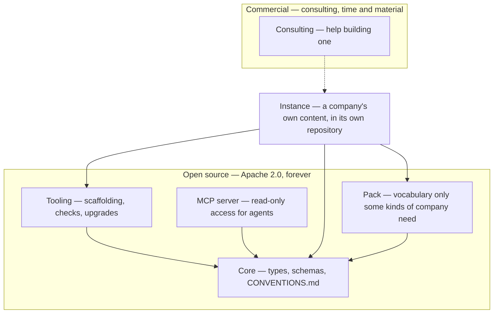

# CompanyGraph — Meta Model

> A meta-model for operating a company: a blueprint you instantiate, published open source.

CompanyGraph is the structure a company's own knowledge takes so that both people and
agents can rely on it — types, schemas, and the conventions that make a graph of Markdown
files checkable.

It is not invented. It is the generalization of a model that already works in two places
that never knew about each other: a multi-person company, and a company of one. Both
arrived at the same shape — one Markdown file per entity, YAML frontmatter and a
Markdown body, in a folder named for its type, with a separate folder of schemas defining
the structure. This repository is that shape, extracted, with the company-specific parts
named as such.

## What is here

```
core/              the shipped unit, copied whole into an instance
  CONVENTIONS.md   the portable rules that make the graph checkable
  *-schema.md      one per type: identity, vision, profile, experience,
                   experience-kind, achievement-kind, skill, proficiency-level,
                   value, source, surface, strategic-objective, strategy, role,
                   process, phase, track
  manifest.json    the release this unit is
  LICENSE          Apache 2.0, travelling with what it covers
example/           a fictional company, described in those types
lib/instance.mjs   the instance parser, the module a site imports
lib/checks.mjs     the checks an instance is held to, shared by the suite and the checker
bin/check-instance.mjs     the mechanical half of R0, run over one instance by its workflow
verify/
  check.mjs                npm run verify — asserts this repo's own shape
  instance.test.mjs        npm run test:instance — the parser, against fixtures
  instance-checks.test.mjs npm run test:instance-checks — the checks, against fixtures
  rule-citations.test.mjs  npm run test:rules — every rule the parser cites is defined
```

Everything a unit ships lives inside it, so vendoring is a copy rather than a recipe. There is
no file outside `core/` that an instance also needs.

`lib/` is what a consumer imports and `bin/` is what a workflow runs: the parser a site builds
its pages with, and the instance checker a caller invokes by path at the release its manifest
names. Both travel in the package and neither is installed as a command, because nothing here is
published to npm — a consumer takes the package from a tag. A site reads an instance with
`import { parseInstance, parseSchemas, CORE_LABEL } from "companygraph-meta-model/instance"`
— `parseInstance` turns a map of path → Markdown into the graph, read beside a second map of
the schemas it is written against — `parseInstance(files, { sub, schemas })`, the second map
keyed the way `parseSchemas` reads it, one bare `<type>-schema.md` per type whatever folder or
pack it came from — and `parseSchemas` turns that second map into the graph of the vocabulary
itself.

A consumer that offers what a schema declares rather than checking it, an editor's completion,
reads a Type cell with `declarationOf` from the same module and an enum's permitted values with
`enumTokensOf` from `companygraph-meta-model/checks`; both are the one reader the parser and the
checks use themselves. What a Description opens with, a join or a list kind, is read with
`listsDeclarationOf`, `underDeclarationOf` and `listKindOf`, and a consumer that serves or draws
the vocabulary takes all of it at once from `constraintsOf`: per type, every reference with how
many a page may hold, the joins and the list sections.

Both are pure: no filesystem, no network, and nothing imported but the checks' three readers
from the parser beside them, which is
what lets the same checks run in a site's build and in this repository's own suite. `core/` is
deliberately outside the tarball, because the rules are copied into an instance or read over the
GitHub API, never resolved out of `node_modules`.

## How it fits together



An arrow points at what a thing depends on. CompanyGraph owns core, the packs, the server and
whatever tooling gets built for them — all of it Apache 2.0 and staying that way. The company
owns its content and the repository holding it. Consulting is dotted because nothing in it is
required to use any of the rest: it is help, not a dependency, and it is the only part that
costs money.

The server sits beside the tooling rather than between core and an instance: it depends on the
parser this package ships and on nothing an instance declares, and a deployment of it names the
instance and the release it serves. `companygraph/mcp-server` is the package,
`robertblust/mcp-blust-ch` is the deployment that runs it over the reference instance.

## Status

Past its first release and in use by a real instance, with the tooling and some of the remaining
core types still ahead. The current release is the newest tag, and `core/manifest.json` names
it. Core holds one schema per type, and `core/` is the list: identity, vision, profile,
experience, experience-kind, achievement-kind, skill, proficiency-level, value, source,
surface, strategic-objective, strategy, role, process, phase and track. The reference instance,
[`robertblust/mental-model`](https://github.com/robertblust/mental-model), vendors the release
its own pin names and populates the types that release carries, for a company of one, and
blust.ch builds its model pages from it with the parser this package ships, and
`companygraph/mcp-server` serves the same instance to an agent over MCP. What is not there yet
is the tooling, designed and not built, and the rest of the types the design names; the roadmap
below says which.

The model is built spec-first — the design, including what was rejected and why, is in
[`docs/superpowers/specs/2026-08-23-companygraph-design.md`](docs/superpowers/specs/2026-08-23-companygraph-design.md),
and the specs that followed sit beside it in `docs/superpowers/specs/`.

## Instantiating it

An instance is a repository of your own, in two halves:

```
meta/core/         core, copied whole at the release you chose
meta/<pack>/       one folder per pack you declare, the same way
model/             your company: identity.md, vision.md, and the folders the schemas name
```

`model/` is the container and everything in it is an entity (R13). What sits beside it — the
vendored metamodel, your tooling, your working documents — is not content, which is why
nothing walking an instance needs a list of folders to ignore. `meta/` holds one folder per
vendored unit, named for the unit; `core` is the one always present, and a pack is a sibling
rather than a nested special case.

The schemas are the contract; `CONVENTIONS.md` is what an agent checks the result against, and
both are inside `core/` so neither can be left behind. `example/` is there to be read, not
copied — [companygraph.io/example](https://companygraph.io/example/) draws it.

Setting that up and keeping it current is the tooling's job — roadmap item 5, designed and
not yet built. Until it ships, the layout above is the whole recipe.

## Packs

Core is the vocabulary any company can be described in. A **pack** adds vocabulary that only
some kinds of company need *at all* — types that are absent rather than optional. A company
that builds a product has features, architecture decisions and roadmaps; a consultancy has
none of those and should not carry empty folders implying it forgot.

That is the difference between a pack and an unused core type. Core defines a type without
obliging you to populate it: a company that does not group what its people have achieved writes
no `achievement-kind`, and the type stays in core either way. A pack is for vocabulary that
would not belong at all.

No pack ships yet. The mechanism arrives when a second kind of company asks for it.

## Design principles

1. **One Markdown file per entity** — frontmatter for the fields, a Markdown body for the
   prose. A single document holding many entities as headings is not the same thing: those
   headings have no canonical name, so nothing can reference one.
2. **An entity is a file when it owns nothing, and a folder when it owns collections of its
   own** — one mechanism, not two. `skills/java-programming.md` is flat; a profile is a folder
   holding its own file and the experiences it owns.
3. **The canonical name of an entity is its H1** — not a `name` field, not the filename, and
   no fallback chain between them.
4. **Every reference is by canonical name, never by path** — so moving a file breaks nothing,
   and renaming an entity breaks loudly rather than quietly.
5. **Schemas are Markdown, enforced by agents** — not a stage on the way to JSON Schema. With
   the right meta-model you describe the facts as Markdown, and a formal schema language would
   contradict the thesis the model ships under.

## Roadmap

What has shipped, what comes next and what was deliberately deferred are on the organization
profile at [github.com/companygraph](https://github.com/companygraph), beside the diagram of
which repository holds what, because that is the page a reader sees before choosing a
repository. Why each decision was made is in
[`docs/superpowers/specs/`](docs/superpowers/specs/), which is a different thing and stays here.

## License

[Apache 2.0](LICENSE) — the meta-model is open source and stays that way, and so is any
tooling built for it. Consulting is the one thing that costs money; what it costs and how it
is billed is on [companygraph.io/billing](https://companygraph.io/billing/).

Copying `core/` into a repository of your own is the intended use, and Apache 2.0's conditions
attach to distribution: if you publish that repository, carry the license and its attribution
alongside the schema files you took. This project claims no interest in the company content you
write against them — that is your work, and describing it in this vocabulary does not change
whose it is.
