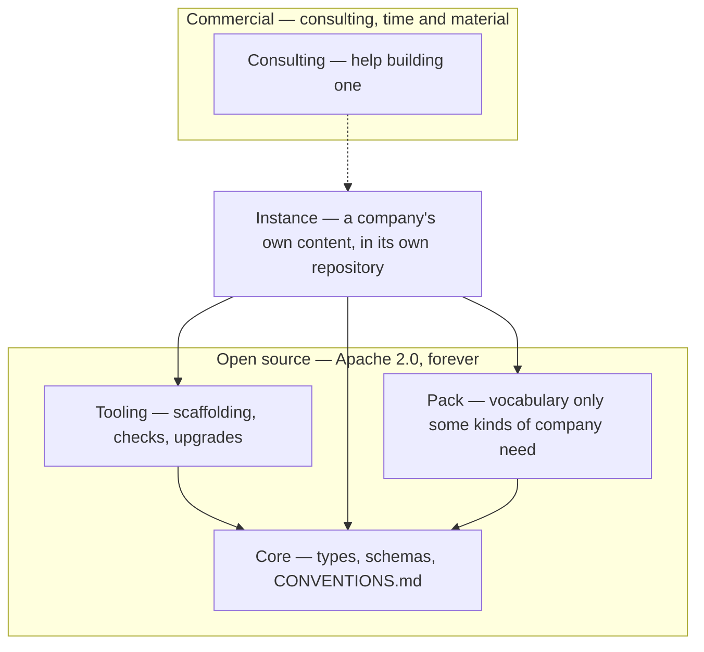

# CompanyGraph — Meta Model

> A meta-model for operating a company: a blueprint you instantiate, published open source.

CompanyGraph is the structure a company's own knowledge takes so that both people and
agents can rely on it — types, schemas, and the conventions that make a graph of Markdown
files checkable.

It is not invented. It is the generalisation of a model that already works in two places
that never knew about each other: a multi-person company, and a company of one. Both
arrived at the same shape — one Markdown file per entity, YAML frontmatter and a
Markdown body, in a folder named for its type, with a separate folder of schemas defining
the structure. This repository is that shape, extracted, with the company-specific parts
named as such.

## What is here

```
core/              the shipped unit, copied whole into an instance
  CONVENTIONS.md   the portable rules that make the graph checkable
  *-schema.md      one per type: identity, vision, profile, experience,
                   skill, proficiency-level, value, source
  manifest.json    the release this unit is
  LICENSE          Apache 2.0, travelling with what it covers
example/           a fictional company, described in those eight types
verify/check.mjs   npm run verify — asserts this repo's own shape
```

Everything a unit ships lives inside it, so vendoring is a copy rather than a recipe. There is
no file outside `core/` that an instance also needs.

## How it fits together



An arrow points at what a thing depends on. CompanyGraph owns core, the packs and whatever
tooling gets built for them — all of it Apache 2.0 and staying that way. The company owns its
content and the repository holding it. Consulting is dotted because nothing in it is required
to use any of the rest: it is help, not a dependency, and it is the only part that costs money.

## Status

🚧 **Early.** One release out, and the model is built spec-first — the design, including what
was rejected and why, is in
[`docs/superpowers/specs/2026-08-23-companygraph-design.md`](docs/superpowers/specs/2026-08-23-companygraph-design.md).

## Instantiating it

An instance is a repository of your own, in two halves:

```
meta/core/         core, copied whole at the release you chose
meta/<pack>/       one folder per pack you declare, the same way
model/             your company: identity.md, vision.md, and the folders the schemas name
```

`model/` is the container and everything in it is an entity (R13). What sits beside it — the
vendored metamodel, your tooling, your working documents — is not content, which is why
nothing walking an instance needs a list of folders to ignore. `meta/` holds one folder per
vendored unit, named for the unit; `core` is the one always present, and a pack is a sibling
rather than a nested special case.

The schemas are the contract; `CONVENTIONS.md` is what an agent checks the result against, and
both are inside `core/` so neither can be left behind. `example/` is there to be read, not
copied — [companygraph.io/example](https://companygraph.io/example/) draws it.

Setting that up and keeping it current is the tooling's job — roadmap item 5, designed and
not yet built. Until it ships, the layout above is the whole recipe.

## Packs

Core is the vocabulary any company can be described in. A **pack** adds vocabulary that only
some kinds of company need *at all* — types that are absent rather than optional. A company
that builds a product has features, architecture decisions and roadmaps; a consultancy has
none of those and should not carry empty folders implying it forgot.

That is the difference between a pack and an unused core type. Core defines a type without
obliging you to populate it: a company of one has no `group`, and the type stays in core,
unused. A pack is for vocabulary that would not belong at all.

No pack ships yet. The mechanism arrives when a second kind of company asks for it.

## Design principles

1. **One Markdown file per entity** — frontmatter for the fields, a Markdown body for the
   prose. A single document holding many entities as headings is not the same thing: those
   headings have no canonical name, so nothing can reference one.
2. **An entity is a file when it owns nothing, and a folder when it owns collections of its
   own** — one mechanism, not two. `skills/java-programming.md` is flat; a profile is a folder
   holding its own file and the experiences it owns.
3. **The canonical name of an entity is its H1** — not a `name` field, not the filename, and
   no fallback chain between them.
4. **Every reference is by canonical name, never by path** — so moving a file breaks nothing,
   and renaming an entity breaks loudly rather than quietly.
5. **Schemas are Markdown, enforced by agents** — not a stage on the way to JSON Schema. With
   the right meta-model you describe the facts as Markdown, and a formal schema language would
   contradict the thesis the model ships under.

## Roadmap

1. ✅ **The person cluster** — `profile`, `experience`, `skill`, `proficiency-level` and
   `value`, the conventions that make them checkable, and a worked example. One person
   described completely, rather than every type partially.
2. ✅ **The reference instance** — a real company described in this vocabulary:
   [`robertblust/mental-model`](https://github.com/robertblust/mental-model), a company of
   one, laid out by hand as the tooling will lay one out. What it taught is §7 of
   [its spec](docs/superpowers/specs/2026-08-26-reference-instance-design.md).
3. **The rest of core** — `identity` and `vision` shipped in 0.4.0, which is what let an
   instance name the company it describes and say where it is going; the remaining types the
   design names are direction, organisation, operation, market, obligation and domain.
4. **Packs** — the mechanism above, deliberately undesigned until a second kind of company
   asks for one.
5. **Tooling** — designed, not built:
   [`docs/superpowers/specs/2026-08-25-companygraph-tooling-design.md`](docs/superpowers/specs/2026-08-25-companygraph-tooling-design.md).
   A separate repository, `companygraph/tooling`, Node with no dependencies, run as
   `npx companygraph` in the manner of [spec-kit](https://github.com/github/spec-kit):
   `init` scaffolds an instance from a bundled or fetched release of this repository,
   `add` writes an entity from its schema, `check` runs the mechanical part of the
   conventions, `upgrade` brings a vendored core to a newer release — and it installs the
   agent skills for validating, adding and exporting an instance as a loadable skill. Its
   half of the contract lives here: `core/manifest.json` naming a version and a shape, and
   a tag on every release.
6. **The validator** — deferred, and when it arrives it will not be one that parses these
   Markdown schemas as its source of truth. The tooling's `check` is deliberately not it: it
   reads the fixed shape and the H1s, never a description. Today `npm run verify` checks this
   repository's own shape, not yours.

## Licence

[Apache 2.0](LICENSE) — the meta-model is open source and stays that way, and so is any
tooling built for it. Consulting is the one thing that costs money; what it costs and how it
is billed is on [companygraph.io/billing](https://companygraph.io/billing/).

Copying `core/` into a repository of your own is the intended use, and Apache 2.0's conditions
attach to distribution: if you publish that repository, carry the licence and its attribution
alongside the schema files you took. This project claims no interest in the company content you
write against them — that is your work, and describing it in this vocabulary does not change
whose it is.
