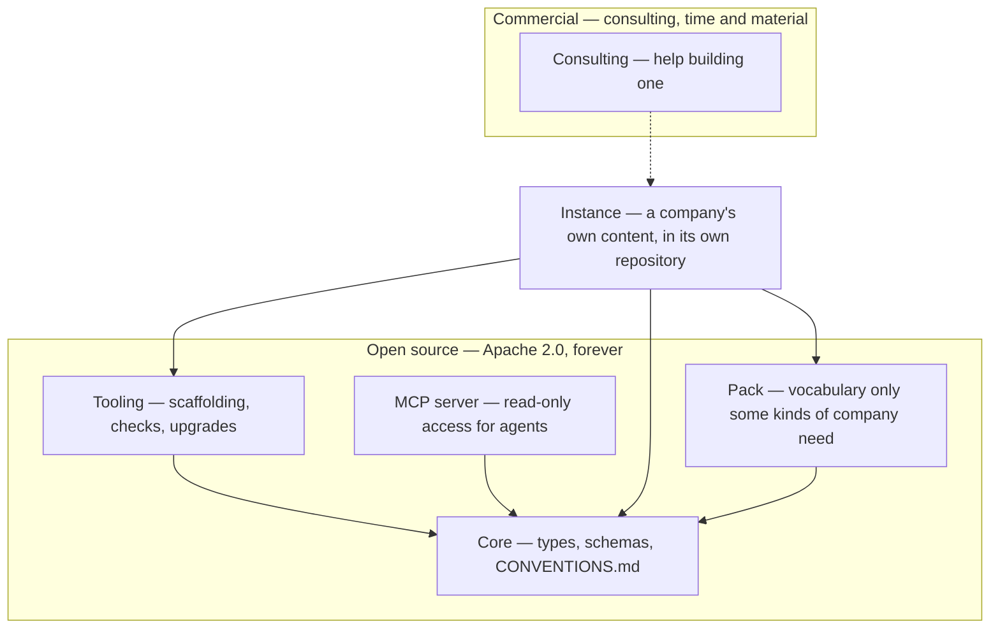

# CompanyGraph — Meta Model

> A meta-model for operating a company: a blueprint you instantiate, published open source.

CompanyGraph is the structure a company's own knowledge takes so that both people and agents can rely on it — types, schemas, and the conventions that make a graph of Markdown files checkable.

It is not invented. It is the generalization of a model that already works in two places that never knew about each other: a multi-person company, and a company of one. Both arrived at the same shape — one Markdown file per entity, YAML frontmatter and a Markdown body, in a folder named for its type, with a separate folder of schemas defining the structure. This repository is that shape, extracted, with the company-specific parts named as such.

## What is here

```
core/              the shipped unit, copied whole into an instance
  CONVENTIONS.md   the portable rules that make the graph checkable
  *-schema.md      one per type: identity, vision, profile, experience,
                   experience-kind, achievement-kind, skill, proficiency-level,
                   value, source, surface, strategic-objective, strategy, role,
                   process, phase, track, product, feature, domain, concept
  manifest.json    the release this unit is
  LICENSE          Apache 2.0, travelling with what it covers
example/           a fictional company, described in those types
lib/instance.mjs   the instance parser, the module a site imports
lib/checks.mjs     the checks an instance is held to, shared by the suite and the checker
bin/check-instance.mjs     the mechanical half of R0, run over one instance by its workflow
bin/companygraph.mjs       the command: init, upgrade and check
agents/claude/skills/      the skills init writes for Claude and upgrade moves
verify/
  check.mjs                npm run verify — asserts this repo's own shape
  instance.test.mjs        npm run test:instance — the parser, against fixtures
  instance-checks.test.mjs npm run test:instance-checks — the checks, against fixtures
  rule-citations.test.mjs  npm run test:rules — every rule the parser cites is defined
```

Everything a unit ships lives inside it, so vendoring is a copy rather than a recipe. There is no file outside `core/` that an instance also needs.

`lib/` is what a consumer imports and `bin/` is what a workflow runs: the parser a site builds its pages with, and the instance checker a caller invokes by path at the release its manifest names, because every instance's CI calls it there rather than through a command. The package's own command is `bin/companygraph.mjs`, the package's `bin`, run straight from a release tag as `npx github:companygraph/meta-model#<tag> <command>`; what it does is under Instantiating it, below. Nothing here is published to npm, so the tag is what a command names, the same way a consumer takes the package.

A site reads an instance with `import { parseInstance, parseSchemas, CORE_LABEL } from "companygraph-meta-model/instance"` — `parseInstance` turns a map of path → Markdown into the graph, read beside a second map of the schemas it is written against — `parseInstance(files, { sub, schemas })`, the second map keyed the way `parseSchemas` reads it, one bare `<type>-schema.md` per type whatever folder or pack it came from — and `parseSchemas` turns that second map into the graph of the vocabulary itself.

A consumer that offers what a schema declares rather than checking it, an editor's completion, reads a Type cell with `declarationOf` from the same module and an enum's permitted values with `enumTokensOf`, from the same module or from `companygraph-meta-model/checks`; both are the one reader the parser and the checks use themselves. What a Description opens with, a join or a list kind, is read with `listsDeclarationOf`, `underDeclarationOf` and `listKindOf`, and a consumer that serves or draws the vocabulary takes all of it at once from `constraintsOf`: per type, every reference with how many a page may hold, every enum with the values it permits, the joins — among them the table whose repeated references carry distinct roles — and the list sections.

Both are pure: no filesystem, no network, and nothing imported but the readers of a cell the checks share with the parser beside them, which is what lets the same checks run in a site's build and in this repository's own suite. `core/` ships inside the tarball now, alongside `lib/` and `bin/`, because a published `init` vendors it into a new instance and must do that without a network call: it reads `core/` straight out of the installed package. Beyond that one case, core is still never imported as a module — a site or the MCP server reads it over the GitHub API, or from the copy an instance already vendored under its own `<units>/core/`.

## How it fits together



An arrow points at what a thing depends on. CompanyGraph owns core, the packs, the server and the tooling built for them — all of it Apache 2.0 and staying that way. The company owns its content and the repository holding it. Consulting is dotted because nothing in it is required to use any of the rest: it is help, not a dependency, and it is the only part that costs money.

The server sits beside the tooling rather than between core and an instance: it depends on the parser this package ships and on nothing an instance declares, and a deployment of it names the instance and the release it serves. `companygraph/mcp-server` is the package, and `robertblust/mcp-blust-ch` and `companygraph/mcp-companygraph-io` are the deployments that run it over the two instances.

## Status

Past its first release and in use by a real instance, with some of the remaining core types still ahead. The current release is the newest tag, and `core/manifest.json` names it. Core holds one schema per type, and `core/` is the list: identity, vision, profile, experience, experience-kind, achievement-kind, skill, proficiency-level, value, source, surface, strategic-objective, strategy, role, process, phase, track, product, feature, domain and concept. The reference instance, [`robertblust/mental-model`](https://github.com/robertblust/mental-model), vendors the release its own pin names and populates the types that release carries, for a company of one, and blust.ch builds its model pages from it with the parser this package ships, and `companygraph/mcp-server` serves the same instance to an agent over MCP. What is not there yet is the rest of the types the design names; the roadmap below says which.

The model is built spec-first — the design, including what was rejected and why, is in [`docs/superpowers/specs/2026-08-23-companygraph-design.md`](docs/superpowers/specs/2026-08-23-companygraph-design.md), and the specs that followed sit beside it in `docs/superpowers/specs/`.

## Instantiating it

An instance is a repository of your own, in two halves:

```
meta/core/         core, copied whole at the release you chose
meta/<pack>/       one folder per pack you declare, the same way
model/             your company: identity.md, vision.md, and the folders the schemas name
```

`model/` is the container and everything in it is an entity (R13). What sits beside it — the vendored metamodel, your tooling, your working documents — is not content, which is why nothing walking an instance needs a list of folders to ignore. `meta/` holds one folder per vendored unit, named for the unit; `core` is the one always present, and a pack is a sibling rather than a nested special case.

The schemas are the contract; `CONVENTIONS.md` is what an agent checks the result against, and both are inside `core/` so neither can be left behind. `example/` is there to be read, not copied — [companygraph.io/example](https://companygraph.io/example/) draws it.

Setting that up and keeping it current is `bin/companygraph.mjs`'s job: one entry point with four subcommands, run from a release tag as `npx github:companygraph/meta-model#<tag> <command>`. Run with no command at a terminal, it opens a menu over the four instead:

```sh
npx 'github:companygraph/meta-model#semver:*'
```

`#semver:*` names the newest release, and the quotes keep a shell from reading the star as a file pattern. The menu asks what the flags would say, the folder and the company's name, asks before it adds to a folder that holds files and before an upgrade it has shown, and calls the same code; a bare run that is not at a terminal, a pipe or a CI step, prints the usage as it always did.

`init [<folder>]` writes a new instance: the vendored core, `.companygraph/manifest.json` with a sha256 per vendored file, a README in the model and in each root type folder, the three entities no instance can pass the checks without — `model/sources/local.md`, `model/identity.md`, `model/vision.md` — a workflow pinned to the release of this checker the instance's manifest names as its `tooling`, and the chosen agent's own files — for Claude, `AGENTS.md`, `CLAUDE.md` and the three skills under `.claude/skills/`: `companygraph-validate`, which runs `check` and then judges every entity against its schema's writing rules, `companygraph-export`, which packages the model for an agent and for Gemini Notebook, and `companygraph-surface`, which produces a surface the model records. That pin is never the tag of a fetched core: which checker runs and which core is vendored are two separate facts, and a core behind the checker is legal by design, so only the first belongs on the workflow line. Claude is the only agent this release writes for, asked for with `--agent claude`, named in what `init` prints, and asking for another is refused by name. The core it vendors is the one inside the release that runs, unless `--core <tag>` names one to fetch from GitHub instead, and the manifest records which, as `bundled` or `fetched:<tag>`; a tag whose core is newer than the release that runs is refused before anything is written, because no checker could then run the instance. `--folders values,processes` writes only the folders named, and `sources/` always, and each folder's README names the schema its files are written against. The fact worth stating plainly: an instance `init` writes passes the checks on its first day, with nothing in its model but those stubs.

`upgrade [<folder>]` moves the vendored core, the skills `init` installed, the manifest and the workflow's tag together, because those are the places a release lands and moving them apart is how one gets left behind. It owns only those places; `AGENTS.md`, `CLAUDE.md` and the rest of the model are the instance's own and are never touched. A vendored file whose hash no longer matches what the manifest recorded was edited inside the instance, and the whole upgrade refuses rather than leave it half old and half new; `--force` overwrites and says which. It ends by running the checks over the instance it has just moved, and a failing check does not undo the upgrade — the files are the release's, the work is the instance's own to do.

`obsidian [<vault>]` puts the Obsidian plugin into a vault, which is how it is installed, since it is not in Obsidian's community directory: the three files of the plugin's newest release, or of `--release <tag>`, into `.obsidian/plugins/companygraph/`, and the plugin switched on in `.obsidian/community-plugins.json`, keeping the plugins already on there. Run again, it updates the plugin and leaves its settings as they are. No plugin release is pinned here, because the plugin pins this package and a pin the other way would make each release wait on the other; the plugin itself refuses a vault whose core is newer than the checker it bundles. The first time Obsidian opens the vault it asks whether its author is trusted, which is Obsidian's guard and no file answers. `--from <dir>` installs a build of one's own, and the plugin's e2e suite installs its build that way, through `lib/obsidian.mjs`.

`check [<folder>]` is a second door to the same mechanical checks the reusable workflow runs, and both hold the vendored core to the manifest's hashes, so an edit to core fails the commit that made it rather than the next upgrade. `bin/check-instance.mjs` keeps its own path and behavior, because every instance's CI calls it there.

## Packs

Core is the vocabulary any company can be described in. A **pack** adds vocabulary that only some kinds of company need *at all* — types that are absent rather than optional. A company that builds software keeps architecture decisions and roadmaps; a consultancy has neither and should not carry empty folders implying it forgot.

That is the difference between a pack and an unused core type. Core defines a type without obliging you to populate it: a company that does not group what its people have achieved writes no `achievement-kind`, and the type stays in core either way. A pack is for vocabulary that would not belong at all.

No pack ships yet. The mechanism arrives when a second kind of company asks for it.

## Design principles

1. **One Markdown file per entity** — frontmatter for the fields, a Markdown body for the
   prose. A single document holding many entities as headings is not the same thing: those
   headings have no canonical name, so nothing can reference one.
2. **An entity is a file when it owns nothing, and a folder when it owns collections of its
   own** — one mechanism, not two. `skills/java-programming.md` is flat; a profile is a folder
   holding its own file and the experiences it owns.
3. **The canonical name of an entity is its H1** — not a `name` field, not the filename, and
   no fallback chain between them.
4. **Every reference is by canonical name, never by path** — so moving a file breaks nothing,
   and renaming an entity breaks loudly rather than quietly.
5. **Schemas are Markdown, read by agents and by the checker alike** — not a stage on the way
   to JSON Schema. With the right meta-model you describe the facts as Markdown, and a formal
   schema language would contradict the thesis the model ships under. The checker reads the
   same tables an agent does, so there is no second format to keep beside them.

## Roadmap

What has shipped, what comes next and what was deliberately deferred are on the organization profile at [github.com/companygraph](https://github.com/companygraph), beside the diagram of which repository holds what, because that is the page a reader sees before choosing a repository. Why each decision was made is in [`docs/superpowers/specs/`](docs/superpowers/specs/), which is a different thing and stays here.

## License

[Apache 2.0](LICENSE) — the meta-model is open source and stays that way, and so is the tooling built for it. Consulting is the one thing that costs money; what it costs and how it is billed is on [companygraph.io/billing](https://companygraph.io/billing/).

Copying `core/` into a repository of your own is the intended use, and Apache 2.0's conditions attach to distribution: if you publish that repository, carry the license and its attribution alongside the schema files you took. This project claims no interest in the company content you write against them — that is your work, and describing it in this vocabulary does not change whose it is.
