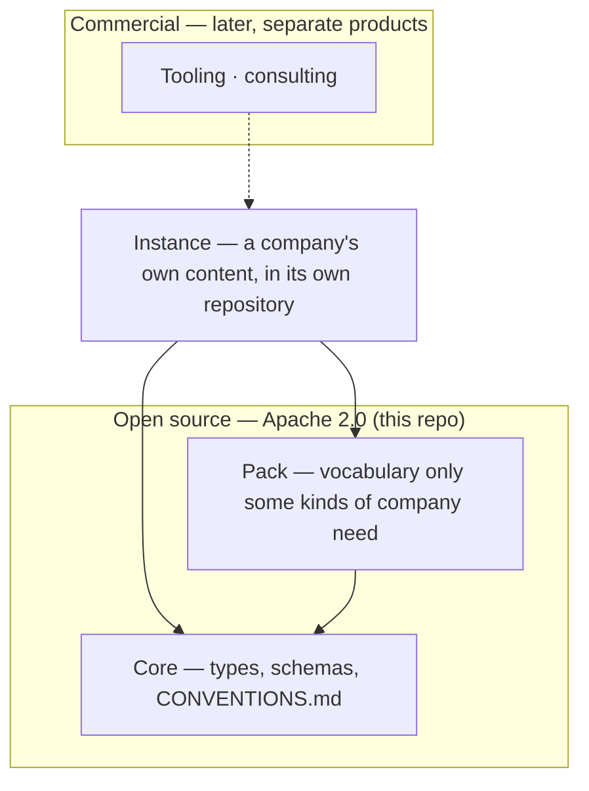

# CompanyGraph

> A meta-model for operating a company: a blueprint you instantiate, published open source.

CompanyGraph is the structure a company's own knowledge takes so that both people and
agents can rely on it — types, schemas, and the conventions that make a graph of Markdown
files checkable.

It is not invented. It is the generalisation of a model that already works in two places
that never knew about each other: a multi-person company, and a company of one. Both
arrived at the same shape — one Markdown file per entity, YAML frontmatter and a
Markdown body, in a folder named for its type, with a separate folder of schemas defining
the structure. This repository is that shape, extracted, with the company-specific parts
named as such.

## What is here

```
core/              one schema per type: profile, experience, skill,
                   proficiency-level, value
CONVENTIONS.md     the portable rules that make the graph checkable
example/           a fictional company, described in those five types
verify/check.mjs   npm run verify — asserts this repo's own shape
```

## How it fits together



An arrow points at what a thing depends on. CompanyGraph owns core and the packs; the company
owns its content and the repository holding it. The commercial layer is dotted because it does
not exist: nothing in it is required to use any of the rest.

## Status

🚧 **Early.** One release out, and the model is built spec-first — the design, including what
was rejected and why, is in
[`docs/superpowers/specs/2026-08-23-companygraph-design.md`](docs/superpowers/specs/2026-08-23-companygraph-design.md).

## Instantiating it

Copy the schemas from `core/` into a repository of your own — wherever that repository keeps
its schemas, so long as it is not inside a folder named for a type — and take `CONVENTIONS.md`
with them. Create the folders the schemas name, and write one file per entity.
The schemas are the contract; `CONVENTIONS.md` is what an agent checks the result against, so
the two travel together. `example/` is there to be read, not copied.

## Packs

Core is the vocabulary any company can be described in. A **pack** adds vocabulary that only
some kinds of company need *at all* — types that are absent rather than optional. A company
that builds a product has features, architecture decisions and roadmaps; a consultancy has
none of those and should not carry empty folders implying it forgot.

That is the difference between a pack and an unused core type. Core defines a type without
obliging you to populate it: a company of one has no `group`, and the type stays in core,
unused. A pack is for vocabulary that would not belong at all.

No pack ships yet. The mechanism arrives when a second kind of company asks for it.

## Design principles

1. **One Markdown file per entity** — frontmatter for the fields, a Markdown body for the
   prose. A single document holding many entities as headings is not the same thing: those
   headings have no canonical name, so nothing can reference one.
2. **An entity is a file when it owns nothing, and a folder when it owns collections of its
   own** — one mechanism, not two. `skills/java-programming.md` is flat; a profile is a folder
   holding its own file and the experiences it owns.
3. **The canonical name of an entity is its H1** — not a `name` field, not the filename, and
   no fallback chain between them.
4. **Every reference is by canonical name, never by path** — so moving a file breaks nothing,
   and renaming an entity breaks loudly rather than quietly.
5. **Schemas are Markdown, enforced by agents** — not a stage on the way to JSON Schema. With
   the right meta-model you describe the facts as Markdown, and a formal schema language would
   contradict the thesis the model ships under.

## Roadmap

1. ✅ **The person cluster** — `profile`, `experience`, `skill`, `proficiency-level` and
   `value`, the conventions that make them checkable, and a worked example. One person
   described completely, rather than every type partially.
2. **The reference instance** — a real company described in this vocabulary. It is the first
   thing that can show the extraction was wrong, which is why it comes before more types
   rather than after them.
3. **The rest of core** — the remaining types the design names: identity, direction,
   organisation, operation, market, obligation, domain.
4. **Packs** — the mechanism above, deliberately undesigned until a second kind of company
   asks for one.
5. **Tooling** — copying `core/` and `CONVENTIONS.md` into a repository of your own is the
   method rather than a stopgap: the schemas are Markdown and an agent enforces them, so there
   is nothing to install. What is missing is the mechanical half — scaffolding the folders a
   schema names, wiring the agent commands, and upgrading an instance in place when core
   moves. The likely shape is a CLI in the manner of
   [spec-kit](https://github.com/github/spec-kit); the upgrade half is an open question in the
   design, not a solved one.
6. **The validator** — deferred, and when it arrives it will not be one that parses these
   Markdown schemas as its source of truth. Today `npm run verify` checks this repository's
   own shape, not yours.

## Licence

[Apache 2.0](LICENSE) — the meta-model is open source and stays that way. Tooling and
consulting come later and are separate products.

Copying `core/` into a repository of your own is the intended use, and Apache 2.0's conditions
attach to distribution: if you publish that repository, carry the licence and its attribution
alongside the schema files you took. This project claims no interest in the company content you
write against them — that is your work, and describing it in this vocabulary does not change
whose it is.
