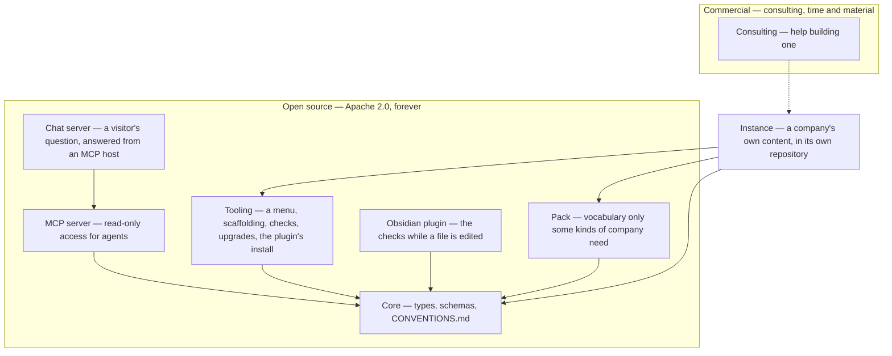

# CompanyGraph — Meta Model

> A meta-model for operating a company: a blueprint you instantiate, published open source.

CompanyGraph is the structure a company's own knowledge takes so that both people and agents can rely on it — types, schemas, and the conventions that make a graph of Markdown files checkable.

It is not invented. It is the generalization of a model that already works in two places that never knew about each other: a multi-person company, and a company of one. Both arrived at the same shape — one Markdown file per entity, YAML frontmatter and a Markdown body, in a folder named for its type, with a separate folder of schemas defining the structure. This repository is that shape, extracted, with the company-specific parts named as such.

## What is here

```
core/              the shipped unit, copied whole into an instance
  CONVENTIONS.md   the portable rules that make the graph checkable
  *-schema.md      one per type: identity, vision, brand, profile,
                   experience, experience-kind, achievement-kind, skill,
                   proficiency-level, value, source, surface,
                   strategic-objective, strategy, kpi, role, process, phase,
                   track, product, feature, domain, concept, question,
                   question-kind, decision, decision-kind, decision-status,
                   rule, risk, control
  manifest.json    the release this unit is
  LICENSE          Apache 2.0, travelling with what it covers
example/           a fictional company, described in those types
lib/instance.mjs   the instance parser, the module a site imports
lib/checks.mjs     the checks an instance is held to, shared by the suite and the checker
lib/obsidian.mjs   the vault: the plugins' install, shared with the plugin's e2e suite, the graph, the panes, and where Obsidian is
bin/check-instance.mjs     the mechanical half of R0, run over one instance by its workflow
bin/companygraph.mjs       the command: init, upgrade, check, judge, form, pins, adopt, obsidian, commits and seats, with a menu over init, check, upgrade, obsidian, seats, adopt and pins
form/                      the one Markdown form: markdownlint's rules and the two the family wrote
.github/workflows/repository-check.yml   the form, for a repository that adopted the tooling and holds no model
types/             the declarations npm run build writes from the JSDoc in lib/ and bin/, committed
agents/claude/skills/      the skills init writes for Claude and upgrade moves
tools/build-check.mjs      npm run build:check — types/ is what the JSDoc declares
verify/
  check.mjs                npm run verify — asserts this repo's own shape
  instance.test.mjs        npm run test:instance — the parser, against fixtures
  instance-checks.test.mjs npm run test:instance-checks — the checks, against fixtures
  rule-citations.test.mjs  npm run test:rules — every rule the parser cites is defined
```

Everything a unit ships lives inside it, so vendoring is a copy rather than a recipe. There is no file outside `core/` that an instance also needs.

`lib/` is what a consumer imports and `bin/` is what a workflow runs: the parser a site builds its pages with, and the instance checker a caller invokes by path at the release its manifest names, because every instance's CI calls it there rather than through a command. The package's own command is `bin/companygraph.mjs`, the package's `bin`, run straight from a release tag as `npx github:companygraph/meta-model#<tag> <command>`; what it does is under Instantiating it, below. Nothing here is published to npm, so the tag is what a command names, the same way a consumer takes the package. The JavaScript is the source, and its types are JSDoc in the same files; the declarations `npm run build` writes from them into `types/` are committed, and each subpath of the package points a TypeScript consumer at its own, so a consumer takes the JavaScript and its types from the tag and builds nothing. The declarations of `./obsidian` name Node's own types, `spawnSync` and `Buffer`, so a consumer that checks them, with `skipLibCheck` off, needs `@types/node`; the other subpaths need no Node types.

A site reads an instance with `import { parseInstance, parseSchemas, CORE_LABEL } from "companygraph-meta-model/instance"` — `parseInstance` turns a map of path → Markdown into the graph, read beside a second map of the schemas it is written against — `parseInstance(files, { sub, schemas })`, the second map keyed the way `parseSchemas` reads it, one bare `<type>-schema.md` per type whatever folder or pack it came from — and `parseSchemas` turns that second map into the graph of the vocabulary itself. The graph `parseInstance` returns names the core it is written in as `core`, the `version` in the `manifest.json` the second map carries when it holds the whole vendored core, and null where it holds none, so a page that draws the graph can say which vocabulary it answers from. It is the version string alone: the MCP server's snapshot carries a `core` of its own that is an object, with the version, the parser and the path, and the two are different files. Each entity the graph carries also carries `id`, the stable id R18 gives it, or its path on an older core that predates R18, and `address`, its folder-and-slug path. `parseSchemas` does the same for a schema: `id` is the stable id its frontmatter holds, or `core/<type>` on a core that predates it, and `address` is always `core/<type>`. Edges in either graph join entities by `id`, so a consumer that needs the type at an edge's end reads it from that entity's `address`, never from the id.

A reader reads a file `IMAGE_FILE` matches as bytes and every other file as text. Bytes are a `Uint8Array`, which a Node `Buffer` is, or the `ArrayBuffer` a fetch hands back; an image read as text is corrupted before anything sees it, and the checks say so by name. A site that publishes images calls `imagesOf(files, data, { sub, schemas })` after `parseInstance` and copies each result's `bytes` to `images/<to>`. `IMAGE_FILE` and `imagesOf` are exported from `companygraph-meta-model/instance` beside `parseInstance`.

A consumer that offers what a schema declares rather than checking it, an editor's completion, reads a Type cell with `declarationOf` from the same module and an enum's permitted values with `enumTokensOf`, from the same module or from `companygraph-meta-model/checks`; both are the one reader the parser and the checks use themselves. What a Description opens with, a join or a list kind, is read with `listsDeclarationOf`, `underDeclarationOf` and `listKindOf`, and a consumer that serves or draws the vocabulary takes all of it at once from `constraintsOf`: per type, every reference with how many a page may hold, every enum with the values it permits, the joins — among them the table whose repeated references carry distinct roles — and the list sections.

A consumer that only needs the language a model is written in, without parsing the whole graph, reads model/localization.md with `localizationOf` from `companygraph-meta-model/localization`, which returns `{ locale }` or an `error` naming why the file cannot be read — the same reader the checks and `upgrade` use.

A `ref → by <Column> in <Owner>` row (R4, R9) names an entity of the type its own row's `<Column>` cell names, and, where that type is owned, within the owner its `<Owner>` cell names — the rule `parseInstance` resolves every such row by, and a consumer completing the same row's cells, before a name is even chosen, would otherwise have to copy. `ownerTypesOf(schemas)` is the owned-type-to-owner-type map read from the schemas' `**Owner:**` lines; `rowScope(entities, schemas, { type, owner })` is what a row's own Type and Owner cells narrow the model's `entities` down to, given as `{ within }` on success; `resolveRow(entities, schemas, { type, name, owner })` adds the name, given as `{ entity }` on success. On failure both give `{ error, subject }`: `error` is the R4 sentence's text and `subject` says which of the caller's own values — `"value"`, the name being resolved, or `"owner"`, the row's own owner cell, for the one case that fails before a name is even looked at — that sentence quotes, so a caller assembles `"<subject>" <error>` the same way `parseInstance` does. Neither function reads a cached copy of `schemas` or `entities`: each call re-derives what it needs and scans `entities` fresh, and `within` is always a newly built array, so a caller changing `entities`, or sorting what a call returned, is never surprised by a stale answer. `entities` need only carry `{ type, name, path }` each — the parser's own entities do, and so does a consumer's that never ran one, such as the Obsidian plugin's — though the "names no `<type>` of `<owner>`" message reads the owner's own `address` first, its `id` where it carries one but no `address`, its owned folder where it is folder-form but carries neither, and falls back to its bare `path` only for an owner with none of those, which has no folder of its own to name instead. An owner is a folder (R6): its own file is `<folder>/<slug>/<slug>.md`, and what it owns sits under `<folder>/<slug>/`; an owner written as a plain file, or a singular type's own root file, owns nothing, whatever it is named — including a file whose own name happens to equal its containing folder's, which is read correctly only where the owner carries an `id` to check that reading against.

Both are pure: no filesystem, no network, and nothing imported but the readers of a cell the checks share with the parser beside them, which is what lets the same checks run in a site's build and in this repository's own suite. `core/` ships inside the tarball now, alongside `lib/` and `bin/`, because a published `init` vendors it into a new instance and must do that without a network call: it reads `core/` straight out of the installed package. Beyond that one case, core is still never imported as a module — a site or the MCP server reads it over the GitHub API, or from the copy an instance already vendored under its own `<units>/core/`.

## How it fits together


```mermaid
flowchart TB
    subgraph commercial["Commercial — consulting, time and material"]
        CONS["Consulting — help building one"]
    end
    subgraph oss["Open source — Apache 2.0, forever"]
        TOOL["Tooling — a menu, scaffolding, checks, upgrades, the plugin's install"]
        SERVER["MCP server — read-only access for agents"]
        CHAT["Chat server — a visitor's question, answered from an MCP host"]
        PLUGIN["Obsidian plugin — the checks while a file is edited"]
        PACK["Pack — vocabulary only some kinds of company need"]
        CORE["Core — types, schemas, CONVENTIONS.md"]
    end
    INST["Instance — a company's own content, in its own repository"]

    CONS -.-> INST
    TOOL --> CORE
    SERVER --> CORE
    CHAT --> SERVER
    PLUGIN --> CORE
    INST --> TOOL & PACK & CORE
    PACK --> CORE
```

An arrow points at what a thing depends on. CompanyGraph owns core, the packs, the server, the chat, the plugin and the tooling built for them — all of it Apache 2.0 and staying that way. The company owns its content and the repository holding it. Consulting is dotted because nothing in it is required to use any of the rest: it is help, not a dependency, and it is the only part that could ever cost money.

The server and the plugin sit beside the tooling rather than between core and an instance: each depends on what this package ships and on nothing an instance declares. The chat depends on neither core nor an instance: it asks a deployed server and holds no model of its own. A deployment of the server names the instance and the release it serves; `companygraph/mcp-server` is the package, and `robertblust/mcp-blust-ch`, `companygraph/mcp-companygraph-io` and `guestgraph/mcp-guestgraph-io` are the deployments that run it, each over one instance and each with the chat beside it. `companygraph/obsidian-plugin` bundles this package's checker, and the tooling's `obsidian` installs it in a vault without pinning it, because the plugin already pins this package.

## Status

Past its first release and in use by real instances, with some of the remaining core types still ahead. The current release is the newest tag, and `core/manifest.json` names it. Core holds one schema per type, and `core/` is the list: identity, vision, brand, profile, experience, experience-kind, achievement-kind, skill, proficiency-level, value, source, surface, strategic-objective, strategy, kpi, role, process, phase, track, product, feature, domain, concept, question, question-kind, decision, decision-kind, decision-status, rule, risk and control. The reference instance, [`robertblust/mental-model`](https://github.com/robertblust/mental-model), vendors the release its own pin names and populates the types that release carries, for a company of one, and blust.ch builds its model pages from it with the parser this package ships, and `companygraph/mcp-server` serves the same instance to an agent over MCP. [`companygraph/mental-model`](https://github.com/companygraph/mental-model) describes CompanyGraph itself and [`guestgraph/mental-model`](https://github.com/guestgraph/mental-model) the project behind GuestGraph, a company whose product is not about modeling; each vendors core the same way and is served the same way. What is not there yet is the rest of the types the design names; the roadmap below says which.

The model is built spec-first — the design, including what was rejected and why, is in [`docs/superpowers/specs/2026-08-23-companygraph-design.md`](docs/superpowers/specs/2026-08-23-companygraph-design.md), and the specs that followed sit beside it in `docs/superpowers/specs/`.

## Instantiating it

An instance is a repository of your own, in two halves:

```
meta/core/         core, copied whole at the release you chose
meta/<pack>/       one folder per pack you declare, the same way
model/             your company: identity.md, vision.md, brand.md, identifier.md, localization.md, and the folders the schemas name
```

`model/` is the container and everything in it is an entity (R13). What sits beside it — the vendored metamodel, your tooling, your working documents — is not content, which is why nothing walking an instance needs a list of folders to ignore. `meta/` holds one folder per vendored unit, named for the unit; `core` is the one always present, and a pack is a sibling rather than a nested special case.

The schemas are the contract; `CONVENTIONS.md` is what an agent checks the result against, and both are inside `core/` so neither can be left behind. `example/` is there to be read, not copied — [companygraph.io/example](https://companygraph.io/example/) draws it.

Setting that up and keeping it current is `bin/companygraph.mjs`'s job: one entry point holding init, upgrade, check, judge, form, pins, adopt, obsidian, commits, seats, id and ids, run from a release tag as `npx github:companygraph/meta-model#<tag> <command>`. Run with no command at a terminal, it opens a menu over init, check, upgrade, obsidian, seats, adopt and pins instead, and comes back after each one until Quit, `q` or Ctrl+C. It clears the terminal before each screen, which shows the latest pick and what it said in one panel, green when it went through and red when not:

```sh
npx --yes 'github:companygraph/meta-model#semver:*'
```

`#semver:*` names the newest release, and the quotes keep a shell from reading the star as a file pattern. `--yes` answers npx's own question, asked once for every release it has not run before, whether to install it. The menu asks what the flags would say, the folder and the company's name, asks before it adds to a folder that holds files and before an upgrade it has shown, comes back from any question on `b` or Ctrl+C with what was written by then left as it is, calls the same code, and after installing the plugin says what is left to do in Obsidian, including the one switch Obsidian keeps outside the vault, Turn on community plugins. It draws companygraph.io's mark and uses color at a terminal, unless `NO_COLOR` is set. A bare run that is not at a terminal, a pipe or a CI step, prints the usage as it always did.

`init [<folder>]` writes a new instance: the vendored core, `.companygraph/manifest.json` with a sha256 per vendored file, a README in the model and in each root type folder, the entities no instance can pass the checks without — `model/sources/local.md` and one file per singular type, `model/identity.md`, `model/vision.md`, `model/brand.md`, `model/identifier.md` and `model/localization.md`, each opening with an `id` of its own (R18) — a workflow pinned to the release of this checker the instance's manifest names as its `tooling`, a `.gitignore` that keeps `dist/` and the vault's state out of git, and the chosen agent's own files — for Claude, `AGENTS.md`, `CLAUDE.md` and the skills under `.claude/skills/`: `companygraph-validate`, which runs `check` and then judges every entity against its schema's writing rules, `companygraph-export`, which packages the model for an agent and for Gemini Notebook, `companygraph-surface`, which produces a surface the model records, `companygraph-profile`, which builds a profile, or extends one, from a folder of the person's documents, `companygraph-company`, which builds the instance from a company's web address, `companygraph-consent`, which both of them call to record the terms and consents a source's content is used under, and `companygraph-judge`, which asks the decision model on the owner's yes to exactly what it would send, writes the report and its reading to `dist/judge/`. That pin is never the tag of a fetched core: which checker runs and which core is vendored are two separate facts, and a core behind the checker is legal by design, so only the first belongs on the workflow line. Claude is the only agent this release writes for, asked for with `--agent claude`, named in what `init` prints, and asking for another is refused by name. The core it vendors is the one inside the release that runs, unless `--core <tag>` names one to fetch from GitHub instead, and the manifest records which, as `bundled` or `fetched:<tag>`; a tag whose core is newer than the release that runs is refused before anything is written, because no checker could then run the instance. `--folders values,processes` writes only the folders named, and `sources/` always, and each folder's README names the schema its files are written against. The fact worth stating plainly: an instance `init` writes passes the checks on its first day, with nothing in its model but those stubs.

`upgrade [<folder>]` moves the vendored core, the skills `init` installed, the manifest and the workflow's tag together, because those are the places a release lands and moving them apart is how one gets left behind. It owns only those places; `AGENTS.md`, `CLAUDE.md` and the rest of the model are the instance's own and are never touched. A vendored file whose hash no longer matches what the manifest recorded was edited inside the instance, and the whole upgrade refuses rather than leave it half old and half new; `--force` overwrites and says which. Where a core carrying `localization-schema.md` finds the instance with no `model/localization.md` of its own, it writes one — a fresh id, `source` read from `model/identity.md` — and never where the instance already has one. Where the core's localization schema declares `locale` and the instance's page is still the earlier `## Locales` table, it rewrites the page into the field — the primary row's tag, the table gone, the id, the H1, the statement and every other section kept — and refuses, writing nothing, a page that declares a translated language. It ends by running the checks over the instance it has just moved, and a failing check does not undo the upgrade — the files are the release's, the work is the instance's own to do.

`obsidian [<vault>]` makes a vault of an instance, in five steps it says as it goes, and makes the folder first where there is none, as Obsidian itself makes a vault of an empty one. It puts the Obsidian plugin in, which is how it is installed, since it is not in Obsidian's community directory: the three files of the plugin's newest release, or of `--release <tag>`, into `.obsidian/plugins/companygraph/`, and the plugin switched on in `.obsidian/community-plugins.json`, keeping the plugins already on there. It offers two recommended plugins by name, Claudian, which is Claude Code in a pane and needs Claude Code on the machine, and Terminal, a shell in one, and puts in each one answered yes the same way; one already there is updated unasked, `--plugins` answers yes for both and `--no-plugins` no. It writes the graph view, `graph.json`, filtered to the model with one color per root folder of it, and the panes, `workspace.json`, with the identity open and the plugin's views on the right, Claudian beside them where it is installed; both only where the vault has none, since Obsidian rewrites them as a person works, unless `--force`. It looks for Obsidian on the machine and, where it is not found and a package manager puts it there reliably, Homebrew on macOS or winget on Windows, asks before running it; on Linux it names the download. Then it offers to open the vault through Obsidian's own URL, or does so on `--open`. The URL opens only a folder on the list of vaults Obsidian keeps outside every vault, and neither it nor Obsidian's own command line puts one there, so a folder not on it is put there first, one entry added and the rest kept, which is the one write into a file of Obsidian's and is made only while Obsidian is not running, since it reads the list when it starts and holds it in memory after; under a running Obsidian the command offers to quit it the way its own menu does, never a kill, wait until it is gone and reopen it with the vault, which brings back whatever it had open; on a no the way in is Obsidian's own, Open folder as vault. Run again, it updates the plugins and leaves their settings as they are. No plugin release is pinned here, because the plugin pins this package and a pin the other way would make each release wait on the other; the plugin itself refuses a vault whose core is newer than the checker it bundles. The first time Obsidian opens the vault it asks whether its author is trusted, which is Obsidian's guard and no file answers. `--from <dir>` installs a build of one's own, and the plugin's e2e suite installs its build that way, through `lib/obsidian.mjs`.

`check [<folder>]` is a second door to the same mechanical checks the reusable workflow runs, and both hold the vendored core to the manifest's hashes, so an edit to core fails the commit that made it rather than the next upgrade. `bin/check-instance.mjs` keeps its own path and behavior, because every instance's CI calls it there.

`judge [<folder>]` asks a decision model the questions nothing mechanical reaches: every writing rule of the schemas the instance vendored, as a yes-or-no question about each page, with the schema's purpose beside the page, and every bullet of a grouped section as a choice among the entities its headings name. A rule that opens by naming a section, a field or a column of a section's table is asked only of a page that has it, and the report counts the pages it was left out of. It prints a report per page and per rule, advisory and outside every workflow, which the validate skill reads before it reads the rest; it gates nothing and never prints a line that reads as a pass. The judge is TypeSafe's Jev, named in `bin/judges/typesafe.mjs` alone, with the key in `TYPESAFE_API_KEY`. Without a key it prints the questions and sends nothing; with one it names the service and every file it would send, with a digest of all of it and a forecast of the input tokens and what they cost at the price pinned beside the model, and sends only on a yes typed at a terminal or on `--consent <digest>`, the owner's yes carried by an agent that showed them that digest, which refuses once anything sent would differ; nothing piped in sends, so an instance whose pages must not leave the machine does not run it. A run that sends prints the requests and input tokens the service counted, and their cost against that forecast. The report flags by a band read off the calibration the measuring prints (`node tools/measure-judge.mjs [<instance>…]`, by hand), written in `lib/questions.mjs` with the model it was measured against.

`form [<folder>]` holds every Markdown file of a repository to one form, the family's: markdownlint-cli2 at the version the release pins, with the rules in `form/`, over every file but what git ignores and the paths under `exclude` in the manifest, which an instance starts as `dist` and its units folder. The form is fixed; a repository can exclude paths and cannot turn a rule on or off. `--fix` writes every hit markdownlint can write, also where the manifest names another release, since it is a local rewrite no workflow runs and the remedy `upgrade` names; without it the form refuses such a manifest, as the checker does. `check` runs it after the model's checks and both reusable workflows run it, so a form failure fails like any other. The first run fetches the tool with npx and later ones use its cache. `upgrade` runs the form of the release it moves to before it moves anything, and stops on a failure unless `--force`.

`pins [<folder>]` reads `pins.json`, in the shape robertblust/conventions' `PINS.md` gives it, and asks each pin's upstream for its newest version tag or its HEAD with `git ls-remote`, without cloning. Each line says `current`, `behind` with the newest, `unknown` when the upstream cannot be reached, `unmanaged` for a pin the repository's files hold and `pins.json` does not declare, `family` for the family's own `conventions` and `service-conventions` pins, which the family's resync reads and this report does not, or `missing` for an entry that names no line. A pin that is behind is intent until its owner says otherwise, so it exits 0, and 1 only when `pins.json` cannot be read or an entry is missing. It moves nothing. `init` writes a `pins.json` declaring the instance's own `core-release` pin, and `upgrade` writes one where an instance has none.

`adopt [<folder>]` gives a repository that is not an instance, a site or a service that draws a model at a commit, the same form and pins: a manifest with `tooling` and `exclude` and no core, a workflow calling `repository-check.yml`, the seat hook and a `pins.json` that declares its own `core-release` pin, as an instance's does. `check` holds it to the form alone, and `upgrade` moves its tooling and its workflow without vendoring core. In an instance it refuses and points at `upgrade`.

A commit an agent makes is authored by the seat it held, at the domain of the identity's `url`, and names where the work sat in `Process`, `Phase` and `Track` trailers. A person commits under their own address, the `email` of a profile whose `nature` is `human`, whatever seat that profile holds, and such a commit passes without trailers; the identity's `email` is where to reach the company and judges no commit. `companygraph commits` refuses a seat the named phase does not list as executing it; it runs from the `commit-msg` hook `init` writes, which `--no-hook` leaves out, and on every pull request through the instance workflow. The hook fetches the pinned release the manifest's `tooling` names through `npx`, so a commit takes a few seconds where nothing has it cached. `init` sets `core.hooksPath` for the repository it runs in, which is local git config and is not cloned with the repository, so a fresh clone runs `git config core.hooksPath <path>` again, the same command `init` names, before the hook is in use there too. `companygraph seats` reads the history back by seat: for every member on this disk where the repository vendors the family's conventions, and for the repository alone otherwise. `--since <date>` narrows it; left off, it defaults to the day the hook's release was tagged, a constant the command carries, and commits from before that day are reported as the owner's own rather than claimed for a seat the command cannot know.

`companygraph id` prints one fresh id, a UUID version 7. `companygraph ids [<folder>] --backfill` gives every entity page an instance still holds from before R18 the id its first commit fixes, and writes `model/identifier.md` where the instance has none; under a `pattern` format that file already declares, the instance makes its own ids and the tooling only checks them, so the backfill refuses whole rather than stamping a UUID version 7 over it. `companygraph ids [<folder>] --range <a>..<b>` is R18's other half, run on a pull request: it fails a commit in the range that changed an id already on the default branch, rename included. On an instance it holds two more things the range did, read from where the branch began: a decision changes only its `status`, and a name it carries follows the entity it names when that entity is renamed or removed; and a label stays with its item and is never moved or used again. Both sides of each page are put in the Markdown form before they are compared, so a change the form makes anyway is no change. Where a release changes the governing schema of one of the two, the decision schema or the schema of a type that declares labels, with the version of its core or pack moving in the same range, that check is not held and the command says so in one line; any other upgrade, re-pin or resync is held. Refused is 3, not 1, the same split `companygraph commits` makes, so a caller such as a hook can tell a refusal — the backfill under a pattern or an unreadable identifier file, or the range naming an id already changed, a decision rewritten or a label moved — from a run that could not happen at all: not an instance, neither flag, a malformed range, or a git failure, each of which stays 1.

## Packs

Core is the vocabulary any company can be described in. A **pack** adds vocabulary that only some kinds of company need *at all* — types that are absent rather than optional. A company that builds software keeps architecture decisions and roadmaps; a consultancy has neither and should not carry empty folders implying it forgot.

That is the difference between a pack and an unused core type. Core defines a type without obliging you to populate it: a company that does not group what its people have achieved writes no `achievement-kind`, and the type stays in core either way. A pack is for vocabulary that would not belong at all.

One pack ships: `software`, for a company that builds software, with five types from domain-driven design. Its schemas are in `packs/software/`, and its README lists the sources each type draws on and where the pack departs from them. An instance takes it with `companygraph init --pack software`, or later with `companygraph upgrade --pack software`; it is vendored beside core under the units folder, listed in the manifest's `packs`, checked by `check` and moved by `upgrade`. Core is level 0 and a pack level 1: every edge from a pack to core is optional, and no core type names a pack's (R20).

## Design principles

1. **One Markdown file per entity** — frontmatter for the fields, a Markdown body for the
   prose. A single document holding many entities as headings is not the same thing: those
   headings have no canonical name, so nothing can reference one.
2. **An entity is a file when it owns nothing, and a folder when it owns collections of its
   own** — one mechanism, not two. `skills/java-programming.md` is flat; a profile is a folder
   holding its own file and the experiences it owns.
3. **The canonical name of an entity is its H1** — not a `name` field, not the filename, and
   no fallback chain between them.
4. **Every reference is by canonical name, never by path** — so moving a file breaks nothing,
   and renaming an entity breaks loudly rather than quietly.
5. **Schemas are Markdown, read by agents and by the checker alike** — not a stage on the way
   to JSON Schema. With the right meta-model you describe the facts as Markdown, and a formal
   schema language would contradict the thesis the model ships under. The checker reads the
   same tables an agent does, so there is no second format to keep beside them.

## Roadmap

What has shipped, what comes next and what was deliberately deferred are on the organization profile at [github.com/companygraph](https://github.com/companygraph), beside the diagram of which repository holds what, because that is the page a reader sees before choosing a repository. Why each decision was made is in [`docs/superpowers/specs/`](docs/superpowers/specs/), which is a different thing and stays here.

## License

[Apache 2.0](LICENSE) — the meta-model is open source and stays that way, and so is the tooling built for it. Consulting is the one thing that costs money; what it costs and how it is billed is on [companygraph.io/billing](https://companygraph.io/billing/).

Copying `core/` into a repository of your own is the intended use, and Apache 2.0's conditions attach to distribution: if you publish that repository, carry the license and its attribution alongside the schema files you took. This project claims no interest in the company content you write against them — that is your work, and describing it in this vocabulary does not change whose it is.
