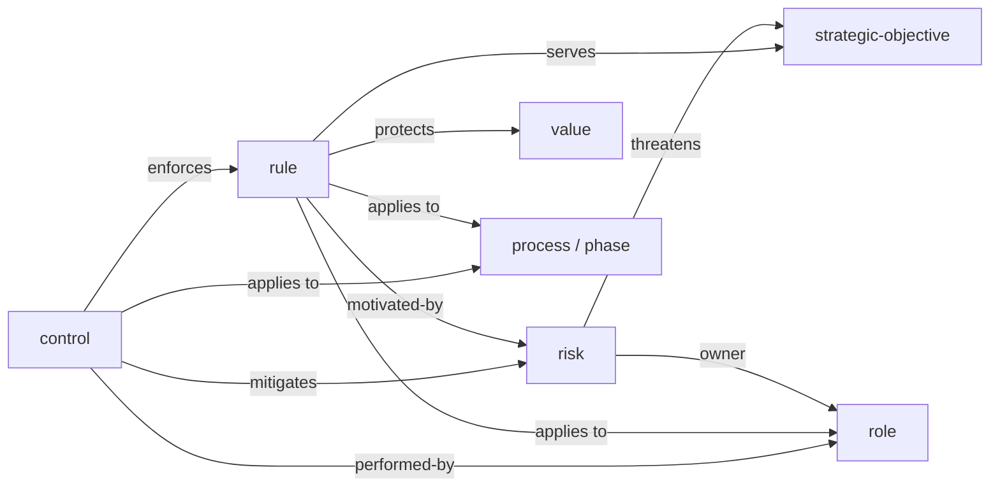

# Rules, risks and controls

Much of what a company knows is rules: what always needs a person, what is never printed, how a change reaches the default branch. Core has no type for one. A value says what the company will never do in general, and a phase, a process or a role says what that one page refuses; a rule that holds across seats and processes is restated on each of them, and nothing says where it is checked. meta-model #196 asks for the type, and asks that it come as one piece of vocabulary with risks and controls, which the owner had kept for later as one piece. This spec adds three core types: `rule`, what must, must not or may happen; `risk`, what could go wrong; and `control`, what the company does so that it does not, which mitigates a risk, enforces a rule, or both.

Status: decided by the owner on September 30, 2026: the three types in core, not a pack; one `rule` type for policy-like and checkable rules alike; no `incident` and no `measure` type; a page's own "never" stays where only that page refuses it, and a rule is for what reaches across; each relation written once, on the more specific side; no risk ratings on the page; a control is the entity and says how it is carried out, and neither a gate criterion nor a check becomes a type; a risk is a downside only; legal documents in a spec of their own; and the type keeps the name `rule`.

Brought up to date on October 2, 2026, after the software pack with R20, one language per model and the machinery outside the family shipped. None of the owner's decisions changed; what the spec now says because of them is under What changed since September 30.

## Where this comes from

The run followed `companygraph-vocabulary`. Its sources:

- **meta-model #196**, from beacon, a company that wants to use CompanyGraph: the kinds of rules it keeps (a working agreement, a definition of done, practices, actions that always need a person, failure patterns to avoid) and what a rule should carry: what it protects, the seats it binds, the processes and phases it applies in, and where it is checked.
- **The family's working conventions**, `robertblust/conventions`, whose `WORKING.md` states the cross-process rules of a real company, each with its reason, and names the hook or check that holds the ones a machine holds.
- **The family's three public instances**, where the same rules live as prose on the pages that refuse them, some restated on several.
- **A multi-person company** that keeps its cross-process rules as files of their own, each with an owner, the seats it binds and, where one exists, the automation that checks it, and keeps its risks and controls in a tracker outside its model.
- **The machinery outside the family**, meta-model v0.70.0: the form check, the pin report and the seat check that any instance runs, so a company outside the family has automated controls of its own to point at.
- **Public practice**, read for each type: the OMG Business Motivation Model and SBVR for rules, ISO 31000 and COSO for risk and control, ISO/IEC 27002 and NIST for control attributes, ArchiMate's motivation elements and its Risk and Security Overlay, and policy-as-code.

The count. Two companies keep rules in their models today, one as prose and one as files, and beacon describes a third; all three build software. No model keeps risks or controls as pages: one company keeps them in a tracker, and the family's controls are hooks, checks and gates with no type. The sources are one kind of company. What makes these types core rather than a pack is public practice: the Business Motivation Model, SBVR, COSO and ISO 31000 are written for every organization, and the design spec already placed `rule` in core. The next evidence this piece asks for is a company of another kind.

## The three types

```text
model/
  rules/<rule>.md
  risks/<risk>.md
  controls/<control>.md
```

None is owned: each reaches across processes and seats, so a name is unique within its type (R2). They join the Operation group, where the design spec placed `rule`. Every schema carries core's `id`, `source` and `source-id` and a `## References` table. They are core's, so R20 holds them to naming core's types only, which every field above and below does; a pack may name them, and none of them names a pack's type.



Every arrow runs from the more specific page to the more general, and none runs back: a rule does not name the control that enforces it, and a risk does not name the control that mitigates it. The MCP server returns both ends of every edge.

### rule

A statement under the company's own authority that obliges, forbids or permits something (SBVR; BMM's directive). `# [Rule]` is its name, and the `>` line is the statement itself, written so that it can be kept or broken.

| Field | Required | Type | Description |
| --- | --- | --- | --- |
| `modality` | Yes | enum | `must`, `must not` or `may`. What the statement does: obliges, forbids or permits (SBVR's obligation, prohibition and restricted permission). |
| `protects` | No | array of ref → value | The values the rule keeps from being broken |
| `serves` | No | array of ref → strategic-objective | The objectives the rule serves (BMM: a directive supports a goal) |
| `motivated-by` | No | array of ref → risk | The risks that are the reason for it (BMM: a directive is motivated by a potential impact) |

Sections: `## Why` (required: the reason, in a paragraph), `## Applies to` (table, optional), `## References` (optional: the law, standard or document it complies with, or where it came from).

`## Applies to` names the seats a rule binds and the processes and phases it applies in, in one table of the shape core's `## Rests on` has: `Type` (string: `role`, `process` or `phase`), `Entity` (`ref → by Type in Owner`), `Owner` (string: the process that owns a phase, blank otherwise). A rule with no rows applies everywhere.

Writing rules. The statement says one thing, as the people it binds would say it. A rule that no control enforces is still a rule, and one a person or a reviewer holds a change against; a statement nobody could tell was kept or broken is advice and is not written (SBVR: no business rule is an advice). A refusal only one seat, one process or one phase makes stays in that page's `## What it never does`; a rule is for what binds more than one of them, or what a control checks, and where a rule replaces a refusal restated on several pages, those restatements are removed. A value's "We never …" is the value's own boundary and stays; a rule may protect it.

### risk

What could go wrong: an event that would affect the company's objectives, from a cause, with a consequence (ISO 31000's risk source, event and consequence; BMM's risk as a potential impact of loss). A downside only. `# [Risk]` names it, and the `>` line says what could happen.

| Field | Required | Type | Description |
| --- | --- | --- | --- |
| `owner` | Yes | ref → role | The seat accountable for the risk |
| `threatens` | No | array of ref → strategic-objective | The objectives it would affect |

Sections: `## Cause` (required), `## Consequence` (required), `## References` (optional: the register or tracker that keeps its current rating, and its history).

Writing rules. A risk is written as an event, not as a feeling or a gap: "a secret reaches a transcript", not "security". It carries no likelihood, impact or score: those are assessments that move, and the model holds how things are made and not their state (R17), as a KPI holds its definition and none of its values. Where the company rates its risks, `## References` points at where it does.

### control

What the company does, or has a machine do, so that a risk is less likely or less harmful, or a rule is kept (ISO 31000: a measure that maintains or modifies risk; COSO's control activities). `# [Control]` names it, and the `>` line says what it does.

| Field | Required | Type | Description |
| --- | --- | --- | --- |
| `kind` | Yes | enum | `preventive`, `detective` or `corrective`. Whether it stops the event, finds it, or repairs what it did (COSO; ISO/IEC 27002 control type). |
| `mode` | Yes | enum | `automated` or `manual`. Whether a machine or a person carries it out (COSO). |
| `mitigates` | No | array of ref → risk | The risks it makes less likely or less harmful |
| `enforces` | No | array of ref → rule | The rules it holds a change or an action to |
| `performed-by` | No | ref → role | The seat that carries it out, for a manual control |

Sections: `## How it is carried out` (required), `## Applies to` (table, optional, the same shape as a rule's), `## References` (optional: the hook, the workflow, the checklist, where its test results are kept).

Writing rules. A control names at least one risk it mitigates or one rule it enforces; the grammar declares each field on its own, so this is the agent pass's to hold. `## How it is carried out` says what does the work and when, as a reader could check: "the seat check, run by the commit hook and again by the instance check on every pull request, refuses a commit whose seat the named phase does not list", or "`companygraph pins` reports every pin that is behind and moves none". The hook, the workflow or the command it names goes in `## References`. A gate is a control where the phase's gate is one: the control names the phase in `## Applies to`, and the gate's criteria stay the phase's bullets.

## The decisions, and why

**Core, not a pack.** Every organization keeps directives and faces risks; the standards say so for any organization, and the design spec placed `rule` in core. The count is one kind of company, which the spec says openly, and asks for a second kind.

**One type for rules.** BMM separates a business policy, which cannot be enforced directly, from a business rule, which can. Neither source company draws the line, and asking every company to classify each statement would buy little: a policy-like rule is one no control enforces, which the graph shows without a second type. A principle already has a home in `value`.

**No incident, no measure.** An incident is a dated record of what happened and a measurement is a value over time; both are the state of the thing made, which R17 keeps outside the model. A risk or a control names where they are kept, in `## References`, and a control's effectiveness is measured by a KPI. Pointing a KPI's `measures` at a control is a change to the `kpi` type, which this spec does not make. "Measure" is also the German «Massnahme», which is ISO's word for a control.

**A page's own "never" stays.** Core's roles, phases and processes already refuse things in `## What it never does`, and values name how they get broken. A rule does not replace them; it takes what reaches across them and is restated on several, which is the duplication #196 names.

**Each relation once, on the more specific side.** The control enforces the rule and mitigates the risk; the rule is motivated by the risk; the risk threatens the objective. A rule with a `checked-by` beside a control's `enforces` would say one thing in two places.

**No ratings.** Every standard rates a risk, and every rating moves. A rating on the page is a number nobody updates and the first moving value core would hold.

**The control is the entity.** The family's controls are hooks, checks and gates, none of them an entity. A control says in prose how it is carried out and points at the file that does it; a gate's criteria and a check's code stay where they are, and no `check` type describes the company's tooling in its model.

**An aggregate's invariant is not a rule.** The software pack's amendment weighed it and left it: a rule binds seats, processes and phases across the company, and an invariant binds one aggregate, so it stays a labelled row of its aggregate, which a test cites by its label.

**A risk is a downside.** [ISO 31000](https://www.iso.org/standard/65694.html) defines risk as the "effect of uncertainty on objectives", and [COSO's enterprise risk management](https://www.coso.org/enterprise-risk-management) likewise counts an opportunity as a risk; the [Business Motivation Model](https://www.omg.org/spec/BMM/1.3/PDF) keeps risk for "the possibility of loss, injury, disadvantage, or destruction" and calls the upside a potential reward. Controls only make sense against a downside, and an opportunity is what an objective or a strategy already pursues.

## Where this departs from its sources

- One `rule` type, where BMM has business policy and business rule.
- No likelihood or impact, where every standard rates a risk.
- No incident and no measure type, where ISO/IEC 27035 and NIST treat them as their own.
- A control's attributes beyond `kind` and `mode` (ISO/IEC 27002's security properties, concepts, capabilities, domains) and its machinery are prose and references, not fields.
- A risk is a downside only, as BMM has it and ISO 31000 does not.

## What was left out

`incident` and `measure`, as above. `legal-document`, which the design spec pairs with `rule`: a text with a version, an effective date, a jurisdiction and parties, closer to what a rule complies with than to a rule, and a spec of its own; until then a rule's `## References` names the law or document. BMM's six enforcement levels, ISO/IEC 27002's control attributes, inherent and residual risk, risk appetite, threats and vulnerabilities: each is what a pack for a regulated company or for information security would add. A `check` type for hooks and jobs.

## Out of scope

Adopting the types in the family's instances, which moves restated "never" bullets into rules page by page, each on the owner's word. beacon's own rules, which the spec invites as the second company's evidence. Renaming the MCP server's `list_rules` and `describe_rule`, which describe the conventions. Phase 2 of the machinery, whose prose check will read a company's word lists from files a control names: this spec gives that control its type and nothing more.

## What it costs

Three schemas in `core/`, three rows in the checker's `TYPES`, and one rule, one risk and one control in the example instance so the checks and the parser meet them. A core release that adds types, which every instance takes on its own re-pin and may leave empty. The name "rule" is shared: the conventions' R0 and onwards and each schema's `## Writing rules` are rules of the vocabulary, and the MCP server's `list_rules` and `describe_rule` describe them, so those two tools say "convention" in their descriptions, and a company's rules are listed with `list_entities` and type `rule`. The vocabulary is English and a model is written in one language, so the types carry no German names of their own; where the family writes about them in German, its glossary calls them «Regel», «Risiko» and «Kontrolle», never «Massnahme», and that row is the glossary's to add.

## What changed since September 30

Three releases landed between the spec and its review. The software pack (v0.68.0) added R20: core names only its own types, and these three name only core's, so nothing in their design moves; the sentence under The three types says so, and the pack's own decision to keep an invariant on its aggregate is recorded under the decisions. One language per model (v0.69.0) retired translated sections, so the spec no longer gives the types German names and leaves those to the family's glossary. The machinery outside the family (v0.70.0) gave every instance a form check, a pin report and a seat check, so the control's example and sources now name checks any company runs rather than the family's conventions job.

## References

| What | URL |
| --- | --- |
| OMG, Business Motivation Model 1.3 | https://www.omg.org/spec/BMM/1.3/PDF |
| OMG, Semantics of Business Vocabulary and Business Rules (SBVR) 1.5 | https://www.omg.org/spec/SBVR/1.5/PDF |
| ISO 31000:2018, Risk management — Guidelines | https://www.iso.org/standard/65694.html |
| COSO, Enterprise Risk Management | https://www.coso.org/enterprise-risk-management |
| COSO, Internal Control — Integrated Framework | https://www.coso.org/internal-control |
| ISO/IEC 27002:2022, Information security controls | https://www.iso.org/standard/75652.html |
| ISO/IEC 27035-1:2023, Information security incident management | https://www.iso.org/standard/78973.html |
| NIST, Cybersecurity Framework 2.0 | https://nvlpubs.nist.gov/nistpubs/CSWP/NIST.CSWP.29.pdf |
| NIST, AI Risk Management Framework 1.0 | https://nvlpubs.nist.gov/nistpubs/ai/NIST.AI.100-1.pdf |
| The Open Group, ArchiMate 3.2 | https://pubs.opengroup.org/architecture/archimate32-doc/ |
| Open Policy Agent, Philosophy | https://www.openpolicyagent.org/docs/philosophy |
| The family's working conventions | https://github.com/robertblust/conventions |
| meta-model #196 | https://github.com/companygraph/meta-model/issues/196 |
