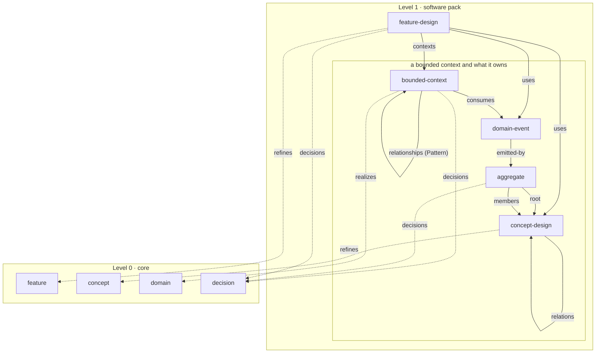

# The software pack

Core describes what every business has: a vision, strategies, decisions, and from enterprise architecture its domains, concepts and features. It has no words for how a company that builds software designs what it builds, and the README has said since the start that "no pack ships yet" and that the mechanism "arrives when a second kind of company asks for it". beacon asked on September 29, after the chat answered their question about a pack for software companies with what core aims for and nothing that ships. This spec ships the first pack, `software`, with five types taken from domain-driven design, and the tooling every later pack will use.

Status: decided by the owner on September 30, 2026: core is level 0 and a pack is level 1, an L1 edge to L0 is always optional and L0 never names L1, the bounded context owns what its language defines, a concept design is a term of that language whose kind is entity or value object, a top-level feature design that uses contexts and owns none, strategic classification on the context, relationships as rows on the downstream context, domain events as a type and commands as rows, architecture decisions as core decisions that the L1 side names, `refines` on the page and no type-level specialization, the pack inside meta-model under core's tag, and no change to core's reference grammar: a table that reaches into another context uses the `Type`, `Entity`, `Owner` shape core's `## Rests on` already has (see Reaching into another context).

Amended by the owner on October 1, 2026, after beacon read the merged spec against its own domain model and before the pack was built: an invariant and a scenario carry a label unique within their page, so a test, a spec or a code comment can cite one; a consumed event's row says what the context does in response; an event's payload takes the form a concept design's attributes have; a page drawn from code names that code as its source; read models are named as left out; and an instance made before the pack takes it with `upgrade --pack` (see After beacon's reading).

## Where this comes from

beacon took up the challenge from the AI Native workshop and asked the chat seven questions first; the pack was one of the five it could not answer. Their thread offers their DDD domain model, drawn from code and checked against it, in CompanyGraph's format. That model is the pack's first outside test, not its source.

The pack draws on three things. A multi-person instance the owner keeps has features as a product-capability catalog, concepts as "Domain X" pages holding a class diagram and a glossary, and architecture decisions with Context, Decision, Consequences and Omit. What it lacks is what this pack adds: a term owned by the language it belongs to, where today the same word sits in several domains with "See Domain X" stubs, and edges from a design to the feature, domain and decisions it serves. Public practice gives the rest: Evans and Vernon for the strategic and tactical patterns, the DDD Crew's Bounded Context Canvas, Aggregate Design Canvas and context-mapping patterns, Context Mapper as the nearest machine-readable DDD metamodel, Daniel Jackson's concept design for the operational principle, Gherkin for scenarios, and ArchiMate and UML for the words `realizes` and `refines`. And the product, feature and ontology spec of September 21 (`2026-09-21-product-feature-and-ontology-design.md`), which rejected nesting concepts under domains because owned-name scoping makes one island per domain; a bounded context is the one place DDD wants exactly that island.

## Levels

Core is level 0: what fits every business. A pack is level 1: vocabulary only one kind of company needs, which refines level 0 for that kind. The level is written in the README and in no field. A `level` field arrives when a pack builds on another pack.

Two rules hold between the levels. Every edge an L1 type draws to an L0 type is optional, so a company can describe its software before its strategy, or without it. And no L0 schema names an L1 type, so a company that takes no pack meets none of its words, and a pack can be removed without leaving core pointing at nothing. The second rule holds by construction, because core ships before any pack and names only its own types, and a check keeps it so (see What the tooling learns).

## The words for the edges

`realizes` is a solution fulfilling a problem-space element: a bounded context realizes a domain. It is ArchiMate's realization and Context Mapper's `implements`. `refines` is the same thing at a later level of detail: a concept design refines a concept, a feature design refines a feature. It is UML's «refine». "Specifies" is not used: no standard uses it for a relation, and in requirements practice the feature is the specification, so the word reads backwards. Specialization between types is not declared anywhere: a type-level line would change nothing, because an L0 field may not name an L1 type, so a concept design could never stand where a concept is expected. Each schema's Purpose says in prose what its type narrows, with its source.

## The five types

```text
model/
  feature-designs/<feature-design>.md
  bounded-contexts/<bounded-context>/
    <bounded-context>.md
    concept-designs/<concept-design>.md
    aggregates/<aggregate>.md
    domain-events/<domain-event>.md
```

The edges between them, and down to core. A solid arrow is an edge within the pack, a dotted one an optional edge from the pack to core, and the inner box is a bounded context with the three types it owns. No arrow runs from core to the pack.



A bounded context is a folder entity (R5, R6) and owns three types (R10); a feature design stands at the top. Every schema carries core's `id`, `source` and `source-id`, a `## References` table, and a Purpose and Writing rules pair, as every core schema does. A page drawn from code names that code as its `source`, the repository a sync reads, and the module or package as its `source-id`; a page written in the model that code then follows names the code in `## References` as `Implementation`. Each schema's writing rules say so, so an agent or a check knows where to compare the page with the code.

### bounded-context

The boundary within which one model and one language hold (Evans; Vernon). `# Name` is the context's name, and the `>` line is its purpose: what it is responsible for, and one thing it leaves to another context.

| Field | Required | Type | Description |
| --- | --- | --- | --- |
| `classification` | Yes | enum | `core`, `supporting` or `generic`: how much it matters to build this well (DDD Crew, Bounded Context Canvas) |
| `realizes` | No | array of ref → domain | The domains this context serves; many to many (Vernon) |
| `decisions` | No | array of ref → decision | The decisions that shaped it |

Sections: `## Responsibilities` (bulleted, required), `## Relationships` (table, optional), `## Consumes` (table, optional: `Type`, `Entity` as `ref → by Type in Context`, `Context` as ref → bounded-context, `Reaction` as an optional string: what this context does in response, naming the handled command in words, since a command is a row and nothing can reference it), `## References`.

`## Relationships` is written on the downstream context, the side that knows it depends, one row per upstream context; a symmetric pattern is written once, by either side. Its columns: `Context` (ref → bounded-context, the edge), `Pattern` (qualifier, an enum of the DDD Crew's nine: `partnership`, `shared kernel`, `customer/supplier`, `conformist`, `anticorruption layer`, `open host service`, `published language`, `separate ways`, `big ball of mud`). The context map is drawn from these rows and never stored. The events this context consumes are named in `## Consumes`.

The classification departs from Evans, who puts it on the subdomain. It sits on the context here, as the DDD Crew's canvas puts it, so that core's domain stays untouched and "core domain" does not collide with core, the vocabulary's own name for level 0. The schema says so.

### concept-design

A term of the context's ubiquitous language, owned by its bounded context, so a name is unique within its context and two contexts may mean different things by one word (Evans: one ubiquitous language per bounded context). `# Name` is the term, and the `>` line is what it means in this context.

| Field | Required | Type | Description |
| --- | --- | --- | --- |
| `kind` | Yes | enum | `entity`: defined by an identity that persists through changes to its attributes. `value object`: defined only by its attributes, and replaced rather than changed (Evans) |
| `refines` | No | ref → concept | The enterprise concept this term narrows |

Sections: `## Attributes` (table, optional: `Attribute`, `Type`, `Description`, where `Type` is a string: a plain type such as `Money` or `date`, or the name of a value-object concept design in the same context, which a reader follows and which draws no edge), `## Relations` (table, optional, the same form as core's concept relations: `Concept` as ref → concept-design, `Cardinality`, `As`, written on one side only), `## References`.

### aggregate

A cluster of concept designs kept consistent as one unit, reached only through its root (Evans; DDD Crew, Aggregate Design Canvas). Owned by its bounded context. `# Name`, and the `>` line says what consistency it protects.

| Field | Required | Type | Description |
| --- | --- | --- | --- |
| `root` | Yes | ref → concept-design | The entity through which the aggregate is reached; its kind is `entity` |
| `members` | No | array of ref → concept-design | The other concept designs the aggregate holds, beside its root |
| `decisions` | No | array of ref → decision | The decisions that shaped it |

Sections: `## Invariants` (table, required: `Label`, `Invariant`, one rule per row, the label unique within the aggregate; a table and not a numbered list, because invariants are a set and not a sequence, and a position is no key a test or a code comment can cite), `## Handled commands` (table: `Command`, `Description`), `## State transitions` (optional), `## References`. A command is a row and not a type, because nothing outside its aggregate names it. The members are a field and not a bulleted section, because a list draws no edge. The events an aggregate emits are not written on it: the edge is written once, on the event, as `emitted-by`, and the aggregate's references show it from the other end.

### domain-event

Something that happened in the domain that other parts of it care about, named in the past tense (Evans; Vernon). Owned by its bounded context. `# Name`, and the `>` line says what happened in business words.

| Field | Required | Type | Description |
| --- | --- | --- | --- |
| `emitted-by` | Yes | ref → aggregate | The aggregate whose change it records |

Sections: `## Payload` (table: `Attribute`, `Type`, `Description`, in the form a concept design's `## Attributes` has: `Type` is a plain type such as `duration` or `timestamp`, or the name of a concept design in the same context, which a reader follows and which draws no edge), `## References`. It is a type and not a row of its aggregate because other contexts and feature designs name it.

### feature-design

How a feature is built across the contexts it touches: the solution side of what core's feature says it gives. It stands at the top, because a context outlives any feature and serves many. `# Name`, and the `>` line says what the design delivers.

| Field | Required | Type | Description |
| --- | --- | --- | --- |
| `refines` | No | ref → feature | The feature this design builds; more than one design may refine one feature |
| `contexts` | Yes | array of ref → bounded-context | The contexts it takes part in, at least one |
| `decisions` | No | array of ref → decision | The decisions that shaped it |

Sections: `## Operational principle` (required: the one scenario that shows why it exists, after Jackson), `## Scenarios` (prose, one `###` per scenario headed `### <Label>: <title>` with the label unique within the feature design, written Given, When, Then after Gherkin; not `Grouped.`, since a scenario is not an entity a heading could name), `## Uses` (table: `Type`, `Entity` as `ref → by Type in Context`, `Context` as ref → bounded-context, one row per concept design or domain event the design touches), `## References`.

## Architecture decisions

No type. An architecture decision is a core `decision` whose kind is an instance's Architecture decision-kind; Nygard's and MADR's sections are the ones `decision` already has. The L1 side names the decisions that shaped it through `decisions` on a context, an aggregate or a feature design, so the edge runs from L1 to L0 and the MCP server returns it from both ends. Supersession is a question for core's decision, for every business, and is not taken up here.

## Sources in the schema

Every term a pack schema defines names where its definition comes from, where the reader meets it: an enum token's description ends with its source, and a section borrowed from a canvas says which. The schema's `## References` lists each source with its address. Where the pack departs from its source, the schema says so and why: the classification on the context, events as a type, commands as rows. A departure is then a decision a reader can see, not a drift.

## Reaching into another context

A feature design names concept designs and domain events in the contexts it uses, and a context names the events it consumes from another. Each reaches an owned type from outside its owner, which core does only through `ref → by <Column> in <Owner>` (R4, R9), reading the type from a string column of the same row. The pack uses that form as core's `## Rests on` and `## Bears on` do: `## Uses` and `## Consumes` carry `Type`, `Entity` and `Context`, and `Entity` is `ref → by Type in Context`.

In `## Uses` the Type cell carries information, since a row names a concept design or a domain event. In `## Consumes` it is `domain-event` on every row today, and carries information once a context also consumes an interface or a published language, which is what a later version of this pack would add. A single-type form, `ref → <type> in <Owner>`, was weighed and left out: nothing in core needs it yet, and the first pack stays an addition to core with no new mechanism. It is cheap to add, and backward-compatible, the day a second case needs it.

## What the tooling learns

The pack lives in `packs/software/` in meta-model: five schemas and a README that lists its sources and what it defers. It is released under core's tag, so a pack is never taken against a core it was not checked with. The first design spec's rule holds: packs start inside the repository until one needs its own release cycle.

`init --pack software` vendors the pack to `meta/software/` in the instance and writes `"packs": ["software"]` to `.companygraph/manifest.json`, which the tooling spec reserved. `check` reads every unit the manifest lists. `upgrade --pack software` does the same for an instance made before it took the pack: it vendors the pack at the release the upgrade moves to and adds it to `packs`, so a company can start its instance before the pack ships and take it later without a second `init`.

Three places assume core is the only unit and learn otherwise: `bin/check-instance.mjs`, which hard-codes `core` as the units folder; the `TYPES` constant in `lib/checks.mjs`, beside which a `PACKS` constant states each pack's types as `TYPES` states core's, because the folder, owner and filename form a check needs are stated there and never derived; and `parseSchemas` in `lib/instance.mjs`, whose `address` still reads `core/<type>` for whatever reads a type and will read `<unit>/<type>`. A schema's id is untouched: a pack schema carries one as core's do. The parser then receives core's and the pack's schemas as one map, as the typed-resolution spec already says.

Three checks are added, each holding one sentence of a new rule after R19: a schema in `core/` names only types core declares; a pack's type name is not a core type's; and a pack's schema names only core's types and its own. The rule:

> **R20 — A unit names only what it may.** Core names only its own types. A pack names core's types and its own, and no other pack's. A type's name is unique across every unit an instance takes.

One check is the pack's own and not a rule of the vocabulary: a label in an aggregate's `## Invariants` and in a feature design's `## Scenarios` is a token of letters, digits and hyphens, and no two on one page are the same. It holds what a citation from outside needs and nothing more. A label that changes still breaks the citations that use it, as a renamed file breaks a link, and no check can see those from inside the model.

The MCP server, the chat and the Obsidian plugin see the pack's types through the parser with no change of their own. That is proved with one `list_types` against the fixture instance, not assumed.

Translations follow R19 unchanged: a pack schema's elements have paths as core's do, and a page of a pack type carries its locale sections like any other.

## How it is proved

`verify/` gains a fixture instance that takes the pack: one bounded context with an entity and a value-object concept design, an aggregate rooted in the entity, an event it emits, a second context whose Relationships row names the first and whose Consumes row names that event, and one feature design that refines a core feature and names both contexts. The aggregate carries labelled invariants, the feature design labelled scenarios, the Consumes row a reaction and the event a payload with a plain type and a concept design. Every new check is first shown to fail on a fixture broken for it, and then to pass on the fixed one.

The first real use is CompanyGraph's own. It builds software, so `companygraph/mental-model` takes the pack and describes one context, the parser's resolution, which "Run on what we publish" asks of anything shipped. beacon's model follows as a feature request that points at this spec and a pull request to their own instance, not to core.

## What was left out

Services, repositories, factories and modules: nothing in the owner's instances or beacon's thread needs them yet. C4's system, container and component, which describe deployment rather than design; a C4 pack or a later version of this one can realize bounded contexts. A context-relationship type, since the row already draws the edge. Commands as a type. Subdomain as a type, since core's domain serves. A `level` field. Jackson's concept as a type, since its operational principle lives in the feature design. Supersession on decisions. Read models and policies as types, from Event Modeling: a policy is the `Reaction` on a Consumes row, and a read model, the view built from events, waits for an instance that writes one, beacon's first context being the likely one.

## After beacon's reading

beacon read the merged spec against its own domain model and asked six questions before the build began. Four changed the spec. Its invariants carry labels such as `INV-T1` that specs, tests and code comments cite, and a numbered list breaks every one of them on a reorder; its acceptance criteria are Given, When, Then scenarios tied to the tests that prove them; its model is built on Event Modeling, so a context reacts to the events it consumes; and its events carry plain values beside the concepts they name. Each now has a place, above. The fifth, where a context's code is, needed one sentence on what `source` already means. The sixth asked whether `classification: core` was kept on purpose beside core the vocabulary: it was, because it is the DDD Crew's word and the one practitioners know, and the schema says why. An invariant as a #217 rule was weighed and left: a rule binds seats, processes and phases across the company, and an invariant binds one aggregate.

The payload's change costs an edge. A `Concept` column drew one from the event to each concept design it carried; a `Type` column draws none, as a concept design's attributes draw none. Nobody had asked for the edge, and one form for attributes and payload is one thing to learn.

## Out of scope

The re-pins of the three instances, which stay with the owner, and which of them takes the pack: only `companygraph/mental-model` does in this spec. The reply to beacon.

## What it costs

One meta-model minor that carries core and the pack together, with release notes that name R20. An instance that takes no pack sees three checks that pass and nothing else. The pack's cost to an adopter is five folders it can leave empty and one command.
