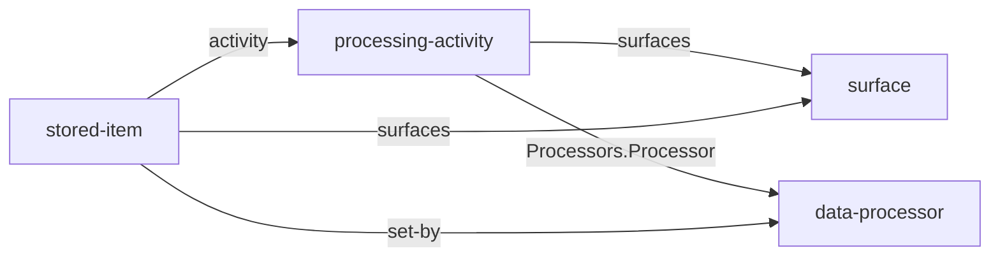

# Processors, processing activities and stored items

A company that holds personal data hands some of it to vendors, and a company that runs a website keeps things on its visitors' devices. The law asks it to know both and to say both: which parties process data on its behalf, for what, under which contract and safeguard, and what each page stores in the browser, for how long and why. Core has no type for any of it. The facts end up as hand-written prose on a privacy page, where no check can compare them with the model or with the code, and the same figure is kept by hand on the page, in the model and in the deployment. This spec adds three core types: `data-processor`, a party that processes personal data on the company's behalf; `processing-activity`, one thing the company does with personal data, which names the processors it uses; and `stored-item`, one thing a surface keeps on a visitor's device under one name.

Status: decided by the owner on October 3, 2026: core, not a pack, and not a pack named "compliance", which the design spec's rule that a pack is named for a kind of company forbids; the processor in the narrow legal meaning of GDPR Art. 4(8) and DSG Art. 5 lit. k, with a vendor's own purposes in its page's prose and independent recipients left for later; local storage and session storage as one type, `stored-item`, with both as values of a `mechanism` field; the processing activity as a third type; a processor's own sub-processors as a reference to its list plus an authorization field, never as pages; the five edges below, each written once; what differs between EU and Swiss law reshaped into a per-jurisdiction table and plain facts, with no change to the grammar; and a stored item's H1 is its key.

## Where this comes from

The run followed `companygraph-vocabulary`. It used no private source. Its sources:

- **The owner's request**, for the processors the company uses, with everything GDPR and the Swiss DSG ask it to record about each, and for what a privacy page and its cookie policy disclose.
- **The family's three public instances and their sites**, a company of one, an open-source project and a product company. Each site has a privacy page written by hand, in two languages, naming the vendors a chat sends data to and the keys each page stores in the browser. None of the instances has a place for any of it, so every privacy fact is delegated to the page. Read against the code, the pages had drifted: a key one page sets is on none of them, a vendor that receives every chat request is named on none of them, and a retention figure is kept by hand in several places.
- **Public practice for the processor**: GDPR Art. 4, 13, 14, 28, 30 and 44–49; the EDPB's Guidelines 07/2020 on controller and processor; the Commission's standard contractual clauses for Art. 28 and for transfers; the Swiss DSG Art. 5, 9, 12, 16, 17 and 19; the records templates of the ICO, the CNIL and the German DSK; the W3C Data Privacy Vocabulary; ISO/IEC 29100 and 27701; the sub-processor lists vendors publish; and one vendor's published terms as a worked example.
- **Public practice for device storage**: the WHATWG HTML Web Storage section and Storage Standard; RFC 6265 and its successor draft; the ePrivacy Directive Art. 5(3) and the EDPB's Guidelines 2/2023 on its technical scope; the Article 29 Working Party's opinion on the consent exemption; the German TDDDG § 25; the Swiss FMG Art. 45c and the FDPIC's guideline on cookies; the UK PECR and the ICO's guidance on storage and access technologies; the CNIL's rules on trackers; the CJEU's Planet49 ruling; the declarations consent platforms publish; the IAB's device storage disclosure; and the W3C Data Privacy Vocabulary's technology extension.

The count. Three companies of three kinds show all three types, and all three thinly: each uses processors for its chat and its hosting and keeps items in its visitors' browsers, and none has a place in its model for either. Public practice shows the types in every company the law reaches, which is any company that holds personal data or runs a website, whatever its kind. That is what makes them core. The evidence the next change should ask for is a company outside the family whose model already keeps a record of processing.

## The three types

```text
model/
  data-processors/<data-processor>.md
  processing-activities/<processing-activity>.md
  stored-items/<stored-item>.md
```

None is owned. A processor serves several activities, an activity uses several processors, and one stored item is set on several surfaces of one instance, so nothing has a single owner to nest in, and a name is unique within its type (R2). Every schema carries core's `id`, `source` and `source-id` and a `## References` table. They are core's, so R20 holds them to naming core's types only; each names `surface` or one of the three, and no core type names them back.



Every arrow runs from the page that knows the relation to the page it names, and none runs back. A processor does not list its activities and a surface does not list its stored items; both are read from the edges, which the MCP server returns at both ends.

### data-processor

A party that processes personal data on the company's behalf (GDPR Art. 4(8); DSG Art. 5 lit. k, «Auftragsbearbeiter»). `# [Processor]` is the name the company calls it by, and the `>` line says what it does for the company.

| Field | Required | Type | Description |
| --- | --- | --- | --- |
| `legal-name` | Yes | string | The legal entity the contract is with, which may differ from the H1 and from one region to another |
| `countries` | Yes | array | Where it processes and stores the data, each an ISO 3166-1 alpha-2 code |
| `retention` | No | string | How long it keeps what it receives, under its own terms, as it states it |
| `sub-processor-authorization` | No | enum | `general` or `specific`. Whether the contract lets it add sub-processors after notice, or only with the company's approval of each (GDPR Art. 28(2); DSG Art. 9(3)). |

Sections: `## Own purposes` (optional: what it does with the data for itself, where it decides that and not the company), `## Transfers` (table, optional), `## References` (required: the data processing agreement, its sub-processor list, its privacy policy, its retention terms).

`## Transfers` says, for each jurisdiction whose law asks, what makes the disclosure abroad lawful. Its columns are `Jurisdiction` (enum: `eu`, `ch` or `uk`) and `Safeguard` (string: the instrument as its law names it, such as "EU–US Data Privacy Framework" or "standard contractual clauses, module two, with the Swiss addendum"). A processor whose `countries` all lie where the company's law needs no safeguard has no rows.

Writing rules. The `>` line says what the processor does for the company, not what the vendor sells. `countries` lists where the data is processed and stored, not where the vendor is incorporated. `## Own purposes` names each purpose the vendor decides for itself, in the words of its terms, because for that processing it is a controller and not the company's processor (GDPR Art. 28(10); EDPB 07/2020). `retention` is the vendor's figure in the vendor's words; the company's own retention is the activity's. The vendor's list of its sub-processors is a row of `## References`, never a page of the model: it is the vendor's to keep, and the vendor's duty to announce changes to it.

### processing-activity

One thing the company does with personal data, for one purpose (GDPR Art. 30(1); DSG Art. 12 «Bearbeitungstätigkeit»). `# [Activity]` names it, and the `>` line is its purpose.

| Field | Required | Type | Description |
| --- | --- | --- | --- |
| `legal-basis` | Yes | enum | `consent`, `contract`, `legal-obligation`, `vital-interests`, `public-task` or `legitimate-interests`. The ground the processing rests on (GDPR Art. 6(1)). |
| `retention` | No | string | How long the company keeps the data, or the criterion that decides it |
| `surfaces` | No | array of ref → surface | Where a person whose data it is meets the activity, each the H1 of a file in `surfaces/` |

Sections: `## Data subjects` (required, bulleted: whose data it is), `## Personal data` (required, bulleted: which data, marking special categories), `## Processors` (table, optional), `## References` (optional).

`## Processors` names who the data goes to: `Processor` (`ref → data-processor`) and `Receives` (string: what that processor gets, which may be less than the activity holds). An activity the company does in-house has no rows.

Writing rules. The `>` line states one purpose, as the person whose data it is would understand it. `## Personal data` names categories, not fields of a schema, and marks a special category (GDPR Art. 9; DSG Art. 5 lit. c) as such. A `## Processors` row's `Receives` says what reaches that processor and nothing more, so a processor that sees only part of the data is never listed as seeing all of it. `retention` states the company's own period; a processor's period is on its page.

### stored-item

One thing a surface keeps on a visitor's device under one name (ePrivacy Directive Art. 5(3); FMG Art. 45c). `# [Key]` is the key or cookie name exactly as the code writes it, and the `>` line says what it holds.

| Field | Required | Type | Description |
| --- | --- | --- | --- |
| `mechanism` | Yes | enum | `local-storage`, `session-storage`, `cookie`, `indexeddb` or `cache`. How the browser keeps it: the two Web Storage areas, an HTTP cookie, an IndexedDB database or the Cache API (WHATWG). |
| `necessity` | Yes | enum | `strictly-necessary` or `optional`. Whether the service the visitor asked for needs it. What follows — consent, information and an opt-out, or neither — is the law's and differs by jurisdiction; the instance's rules cite it. |
| `duration` | No | string | How long it stays, where the mechanism does not decide it |
| `surfaces` | Yes | array of ref → surface | The surfaces that set it, each the H1 of a file in `surfaces/` |
| `set-by` | No | ref? → data-processor | The party that sets or reads it, where that is not the company. A name that resolves is a processor; one that does not stays a name. |
| `activity` | No | ref → processing-activity | The activity it serves, where what it holds is personal data |

Sections: `## References` (optional).

Writing rules. The H1 is the key as the code writes it, character for character, so a check can compare the keys a surface sets with the model by name. The `>` line says what the item holds and why, in the words a privacy page would use. `duration` is absent for `session-storage`, which ends with the tab, and present for anything that outlives it, stated as the code sets it or as "until the visitor clears it". `set-by` is absent for an item the company's own code sets.

## The decisions, and why

**Core, not a pack.** The owner's first guess was a pack called "compliance". The design spec names a pack for a kind of company and never for a subject, and the count does not find a kind: three companies of three kinds have processors and stored items, and the law reaches any company that holds personal data or runs a website. A company with neither leaves the folders empty, which is what core defining a type without obliging anyone to populate it allows.

**The narrow meaning of processor.** A privacy page names recipients, which is wider: it includes parties that receive data for their own purposes (GDPR Art. 4(9), Art. 13(1)(e); DSG Art. 19). Every vendor the family uses is a processor, and a vendor that also decides some purposes itself — keeping flagged content for its own enforcement, say — says so in `## Own purposes`. A type for independent recipients waits for a company that has one.

**One type for stored items.** The owner named local storage and session storage. Every source treats them as one kind of thing with a mechanism: WHATWG has one `Storage` interface whose type is local or session; the law speaks of information stored in terminal equipment, whatever stores it; consent platforms and the IAB keep one table with a type column. Two types would carry the same fields twice and need a third for the first cookie. The owner's names are the values a reader meets.

**A third type, the activity.** Most of what the law asks sits on the activity, not on the vendor: purpose, legal basis, data subjects, data categories, the company's retention (GDPR Art. 30(1); DSG Art. 12; every records template read; DPV; the de facto tools). One vendor serves several activities, so those facts on the vendor's page would be wrong the first time it does.

**Sub-processors by reference.** The processor keeps its list and must announce changes to it (GDPR Art. 28(2); EDPB 07/2020). Pages for every sub-processor would make the company keep a copy of a list that is not its own and that goes stale without notice. The company records how it authorized them, which is its own fact.

**Law that differs, reshaped.** The grammar has no enum whose values depend on another column, and the transfer instruments differ between the GDPR and the DSG. A `## Transfers` row per jurisdiction names the instrument as a string; a stored item records the fact the law turns on, whether it is strictly necessary, and not the consequence; the legal basis uses GDPR Art. 6(1)'s list, which the DSG does not contradict, since it asks for a justification only where processing infringes personality.

**The H1 is the key.** The canonical name is then what the code writes, and a check can compare a surface's keys with the model without reading a field. The family's existing check compared them with the privacy page's prose and missed the key a chat sets, because the page and the code had only the text to share.

**Edges written once.** An activity names its processors, and an item names its surfaces, its setter and its activity. A processor listing its activities, or a surface listing its items, would say each relation twice.

## Where this departs from its sources

- Local storage and session storage are values of one field, where the owner named two types.
- `local-storage` means the Web Storage area WHATWG defines; the W3C Data Privacy Vocabulary's `tech:LocalStorage` means any storage on the device, with a cookie as one kind of it.
- `data-processor` takes the narrow meaning where a privacy page names recipients.
- "Sub-processor" is GDPR practice; the DSG calls it a third party («einem Dritten»), which the GDPR's definitions forbid for a processor, and ISO/IEC 27701 calls it a subcontractor.
- The data processing agreement is a row of `## References`, where the W3C vocabulary has a concept for it.
- No category scheme for stored items (Cookiebot's, the ICC's, the IAB's purposes): the law fixes only whether an item is strictly necessary.

## What was left out

A type for independent recipients and joint controllers. `legal-document`, which would hold the agreement with its version and parties, and which the rules spec left for a spec of its own. A taxonomy of data categories or data subjects as entities; the W3C vocabulary has one, and a company's own list fits its bullets until something outside the activity names a category. A `country` type. A duration type in the grammar. The controller's own identity and contact, which core's `identity` already holds. A data protection impact assessment and a transfer impact assessment, each a document a `## References` row can point at.

## Out of scope

Writing the family's processors, activities and stored items, and a privacy page built from them, which is each instance's work on the owner's word. A check that compares the keys a surface's code sets with the stored items that name it; it reads a site, not a model, so it belongs to the repository that builds the site, and a control in the instance can name it. Consent banners and the signals a browser sends, which are machinery and not vocabulary.

## What it costs

Three schemas in `core/`, three rows in the checker's `TYPES`, and one of each in the example instance so the checks and the parser meet them. A core release that adds types, which every instance takes on its own re-pin and may leave empty. One key under two mechanisms, a `theme` in local storage and a cookie named `theme`, cannot both be written, because the H1 is the key; no site the run read does that, and an instance that needs it renames neither and waits for a spec that does. The type names are English and the law the types come from is often read in German, so where the family writes about them in German its glossary calls them «Auftragsbearbeiter», «Bearbeitungstätigkeit» and «gespeichertes Element», and those rows are the glossary's to add.

## References

| What | URL |
| --- | --- |
| GDPR Art. 4, definitions | https://gdpr-info.eu/art-4-gdpr/ |
| GDPR Art. 28, processor | https://gdpr-info.eu/art-28-gdpr/ |
| GDPR Art. 30, records of processing activities | https://gdpr-info.eu/art-30-gdpr/ |
| GDPR Art. 13, information to be provided | https://gdpr-info.eu/art-13-gdpr/ |
| GDPR Art. 46, transfers subject to appropriate safeguards | https://gdpr-info.eu/art-46-gdpr/ |
| EDPB Guidelines 07/2020 on controller and processor | https://edpb.europa.eu/our-work-tools/our-documents/guidelines/guidelines-072020-concepts-controller-and-processor-gdpr_en |
| Standard contractual clauses between controllers and processors | https://eur-lex.europa.eu/eli/dec_impl/2021/915/oj/eng |
| Standard contractual clauses for transfers to third countries | https://eur-lex.europa.eu/eli/dec_impl/2021/914/oj/eng |
| EU–US Data Privacy Framework adequacy decision | https://eur-lex.europa.eu/eli/dec_impl/2023/1795/oj/eng |
| Swiss Federal Act on Data Protection | https://www.fedlex.admin.ch/eli/cc/2022/491/en |
| Swiss Telecommunications Act, Art. 45c | https://www.fedlex.admin.ch/eli/cc/1997/2187_2187_2187/de#art_45_c |
| FDPIC guideline on cookies and similar technologies | https://backend.edoeb.admin.ch/fileservice/sdweb-docs-prod-edoebch-files/files/2025/06/18/21e8e862-f693-4225-aac9-43c931e076cb.pdf |
| ICO documentation templates | https://ico.org.uk/for-organisations/uk-gdpr-guidance-and-resources/accountability-and-governance/guide-to-accountability-and-governance/documentation/ |
| CNIL record of processing activities | https://www.cnil.fr/fr/RGPD-le-registre-des-activites-de-traitement |
| DSK template for controllers | https://www.datenschutzkonferenz-online.de/media/ah/201802_ah_muster_verantwortliche.pdf |
| W3C Data Privacy Vocabulary | https://w3id.org/dpv |
| W3C Data Privacy Vocabulary, technology extension | https://w3id.org/dpv/tech |
| WHATWG HTML, Web storage | https://html.spec.whatwg.org/multipage/webstorage.html |
| WHATWG Storage Standard | https://storage.spec.whatwg.org/ |
| HTTP State Management Mechanism | https://datatracker.ietf.org/doc/html/rfc6265 |
| ePrivacy Directive, consolidated | https://eur-lex.europa.eu/legal-content/EN/TXT/?uri=CELEX:02002L0058-20091219 |
| EDPB Guidelines 2/2023 on the technical scope of Art. 5(3) | https://www.edpb.europa.eu/system/files/documents/2024-10/edpb_guidelines_202302_technical_scope_art_53_eprivacydirective_v2_en_0.pdf |
| Article 29 Working Party opinion on the cookie consent exemption | https://ec.europa.eu/justice/article-29/documentation/opinion-recommendation/files/2012/wp194_en.pdf |
| German TDDDG § 25 | https://www.gesetze-im-internet.de/ttdsg/__25.html |
| ICO, what storage and access technologies are | https://ico.org.uk/for-organisations/direct-marketing-and-privacy-and-electronic-communications/guidance-on-the-use-of-storage-and-access-technologies/what-are-storage-and-access-technologies/ |
| CNIL, cookies and other trackers | https://www.cnil.fr/fr/cookies-et-autres-traceurs/regles/cookies/que-dit-la-loi |
| CJEU Planet49, C-673/17 | https://eur-lex.europa.eu/legal-content/EN/TXT/?uri=CELEX:62017CJ0673 |
| IAB device storage disclosure | https://github.com/InteractiveAdvertisingBureau/GDPR-Transparency-and-Consent-Framework/blob/master/TCFv2/Vendor%20Device%20Storage%20%26%20Operational%20Disclosures.md |
| A vendor's data processing addendum | https://www.anthropic.com/legal/data-processing-addendum |
| A vendor's published sub-processor list | https://docs.github.com/en/site-policy/privacy-policies/github-subprocessors-and-cookies |
