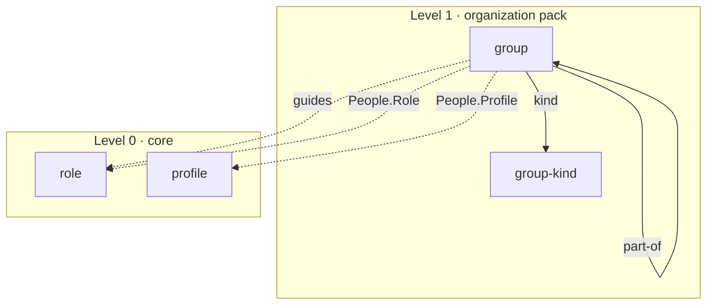

# The organization pack

A company of more than one person has units, and two lines run through them: the disciplinary line, along which a unit's lead hires, appraises and sets objectives, and the professional line, along which one unit sets the standard of a discipline for the people who do that work wherever they sit. Core has a `role` for a job and a `profile` for its holder, and nothing that says who sits together, which unit sits in which, or who answers to whom. The role spec of September 15 dropped a hierarchy of roles as "a fact about a company with more than one" and left `group` out of scope; nothing has taken either up since. This spec adds the second pack, `organization`, with two types: `group`, a unit or a team, and `group-kind`, what kind of group it is and whether it stands in the line.

Status: decided by the owner on October 7, 2026: a pack named `organization` and not core, departing on purpose from the rule that one company is a wait, because public practice shows units in every company of more than one person; a group at the top level with its tree drawn by a field, never by nesting folders; the second line professional, beside the disciplinary one, and the phrase "functional line" used for neither; the professional line written on the guiding unit as the seats it guides; the kind a type of its own; core's `role` as the seat and core's `profile` as the holder, with no position type; the edges below, each written once; three instance checks that hold the lines to a tree, from which a kind outside the line opts out; and the eight departures listed below.

Amended by the owner on October 7, 2026, while the plan was written: a `## People` row's seat is a qualifier with no `lists` join, since core's grammar puts the joined field on the qualifier's entity and a role has no `roles` field, and a fourth instance check holds that the row's profile holds the seat. After the build's review, a group whose `end` has passed is not counted as a seat's unit or guide, so a disbanded unit keeps its page and its history; and a fifth check holds that `part-of` runs only from and to a group whose kind is in the line. Before merge, a `## People` row's `As` became a required enum, `Lead`, `Deputy` or `Member`, because a free-text place could be read by nothing; only a human leads or deputizes in a group, every person named in a group whose kind is in the line is human, and a group has one lead. Before merge, a group's `part-of` may not name a group that has ended, so an org chart never leaves a group without the unit above it. A group's kind is a fact time does not change, so an ended group is still held to the line, and only its reference to a group that has since ended is history.

Amended by the owner on October 8, 2026, before merge: a line runs through people sitting in units, not through seats. Core's `role` is a job, one page held by everyone who does that work, while the seats public practice draws lines through are positions, one place in one unit; read as jobs, two engineering departments could not both hold backend engineers, and two holders of one lead seat could not say which unit each leads. So a group says who sits in it, as what and in which place, in its `## People` table, a department as much as a team; `lead` and `members` leave the group; a person sits in at most one unit in the line; and the leader of any group is the person whose `As` is `Lead`. `guides` stays on roles, because a discipline's standard is set for the job wherever its holders sit.

## Where this comes from

The run followed `companygraph-vocabulary`. Its sources:

- **A multi-person company the owner knows**, a software company, described and not named. It keeps standing units by discipline, cross-functional teams and temporary teams as pages of one kind, and draws its hierarchy only implicitly, through the seats each unit lists, with nowhere to say which unit sits in which or who sets a discipline's standard across teams.
- **Public practice for the unit**: the W3C Organization Ontology's `OrganizationalUnit`, `subOrganizationOf`, `unitOf` and `headOf` (<https://www.w3.org/TR/vocab-org/>); schema.org's `department` and `subOrganization` (<https://schema.org/department>); the object types of SAP's organizational management, where a unit, a position, a person and a job are four things (<https://learning.sap.com/courses/organizational-management-in-sap-hcm-for-s-4hana/finding-object-relationships>); and Gabler's Stelle, a unit defined for an imagined holder (<https://wirtschaftslexikon.gabler.de/definition/stelle-42791>).
- **Public practice for the lines**: the Organization Ontology's `reportsTo`, which covers supervisory and dotted-line reporting in one property on purpose; SAP's line relationship between positions and the dotted line practitioners type beside it; HR-XML's `ReportsToPositionType`, one primary position with related positions beside it (<https://schemas.liquid-technologies.com/HR-XML/3.1/reportstopositiontype.html>); Gabler's Einliniensystem, Mehrliniensystem, Matrixorganisation and Instanz (<https://wirtschaftslexikon.gabler.de/definition/matrixorganisation-39659>); and German labor-law practice, which names the pair by the right each carries, the disciplinary and the professional right to direct (<https://kliemt.blog/2016/07/06/der-betrieb-in-der-matrix-struktur/>).

ArchiMate's own pages and SAP's relationship tables sit behind logins and were read only through secondary sources; the spec rests on nothing it takes from them alone.

The count. One company of one kind shows units, and shows the disciplinary line thinly, drawn through the seats its units list and never as an edge of its own. None shows the professional line. The company of one has neither, because one person holds every seat. The skill this run follows makes one company a wait for the second; this spec departs from it because public practice, not a second instance, shows that every company of more than one person has units and a line, and a pack is the commitment that costs least to move. The evidence the next change should ask for is a second multi-person company whose model writes either line.

Every source that draws a line draws it between positions or units: SAP's position, the Organization Ontology's post and Gabler's Stelle are each one place in one unit, held by whoever fills it. Core's `role` is not that. It is the job, SAP's other object: one description held by everyone who does that work, in whatever unit. The pack therefore draws the position where core has none, as a row of a unit's `## People`: one person, the job they hold there, and their place in the unit. A line runs from that row to the unit's lead and up through the units above. That is the finding the shape below is built on.

## The two types

```text
model/
  groups/<group>.md
  group-kinds/<group-kind>.md
```

Neither is owned. A group's place in the tree is a field, so a reorganization edits one line instead of moving a folder, a team outside the tree stands beside the units it draws from, and a name is unique within its type (R2). Both schemas carry core's `id`, `source` and `source-id` and a `## References` table. They are a pack's, so R20 lets them name core's types and their own; they name `role` and `profile`, every edge to core is optional, and no core type names them back.



### group

A unit of the company, or a team drawn from its units: a department, a team, a board, an initiative team. The tagline says what the group is for.

| Field | Required | Type | Description |
| --- | --- | --- | --- |
| `kind` | Yes | ref → group-kind | What kind of group this is, and so whether it stands in the line |
| `part-of` | No | ref → group | The unit this one sits in: one step up the disciplinary line. Absent at the top and for a group outside the line. |
| `guides` | No | array of ref → role | The jobs whose discipline this group sets, wherever their holders sit: the professional line |
| `start` | No | date | When the group was formed, for a group that is not standing |
| `end` | No | date | When it was disbanded: the last day it existed, as R9 reads an `end`, so a person who moves is in the new unit from the next day and the old unit's `end` is the day before the move. Absent while it exists. |

Sections: `# [Name]`; `> [Purpose]`; `## Responsibilities`, optional and bulleted, what the group answers for; `## People`, optional, a table of the people who sit in the group; `## References`, optional.

`## People` has the columns `Profile` (required, `ref → profile`), `Role` (required, `qualifier → role`, the job the person does in the group, one their profile holds) and `As` (required, `enum`, `Lead`, `Deputy` or `Member`, the person's place in the group). A row is a position: one person, in one unit, doing one job.

A person's disciplinary line is read off the unit in the line whose `## People` names them: they answer to that unit's `Lead`, and a `Lead` answers to the `Lead` of the unit its `part-of` names, and so up the tree. A person's professional line is read off their job: the group whose `guides` lists the `Role` of their row, and that group's `Lead`. Two engineering departments each name their own lead and their own backend engineers, and nothing is ambiguous, because what is unique is the person, not the job.

### group-kind

What kind of group a company has: a standing unit, a cross-functional team, a temporary team, a board. A company names its own kinds; the pack ships none.

| Field | Required | Type | Description |
| --- | --- | --- | --- |
| `in-line` | Yes | enum | `yes` or `no`. Whether a group of this kind stands in the disciplinary line, and so whether the line's checks count it. |

Sections: `# [Label]`; `> [Summary]`; `## What it means`, which groups belong to this kind and which do not; `## References`, optional.

## The checks it owes

A line draws a tree only if each person has one disciplinary unit and no unit sits inside itself, a group says who sits in it truly only if each person holds the job they sit in it as, and a group says truly who leads it only if a human does. Each is a norm across pages, so each is an instance check shipped in the change that adds the pack, not a writing rule:

- `part-of` forms no cycle.
- A profile is named in the `## People` of at most one group whose kind is `in-line: yes`, not counting a group whose `end` has passed.
- A role is in the `guides` of at most one group, not counting a group whose `end` has passed.
- `part-of` is written only on a group whose kind is in the line, and names only such a group; a group that has not ended names only one that has not ended.
- A `## People` row's profile lists the row's role in its `roles`, so a person sits in a group only as a job they hold, not counting a group whose `end` has passed.
- A `## People` row whose `As` is `Lead` or `Deputy` names a profile whose `nature` is `human`.
- In a group whose kind is `in-line: yes`, every `## People` row names a profile whose `nature` is `human`.
- A group's `## People` has at most one row whose `As` is `Lead`.

A board or a cross-functional team is a kind with `in-line: no`, so the people it gathers, who already sit in a unit, are not counted twice. Since every person named in a unit in the line is human, an agent sits in teams and boards and never in the disciplinary line, which is where hiring and appraisal happen.

## The decisions, and why

- **A pack, named `organization`.** A company of one meets none of these words, which is the design spec's test for a pack: absent, not optional. The name says the kind of company it serves, one organized into more than one seat-holder, as the design spec's rule asks of a pack's name.
- **Top level, tree by field.** Nesting would make every reorganization move files, scope a unit's name to its parent, and leave a cross-functional team, which belongs to no unit, with nowhere to go. The same reason kept the software pack's feature design at the top level.
- **The second line is professional.** Line one carries the disciplinary right: hiring, appraisal, objectives. Line two carries the professional one: what good work in a discipline is, across the units its holders sit in. That is the pair German practice names, and what SAP's dotted line and SuccessFactors' matrix manager stand for.
- **The professional line is written on the guiding unit, on jobs.** A discipline's holders sit in several units; the one unit that sets their standard lists the job once, and the line holds wherever a holder moves. Written on the guided unit, it would put a whole cross-functional team under one discipline; written per person, the grammar would make it a qualifier, which draws no edge, and the line could not be drawn.
- **A kind is a type.** Each kind carries a definition and a fact the checks read, which R8 says makes it a type rather than an enum, as `decision-kind` and `question-kind` are in core.
- **Core's role is the job; a `## People` row is the position.** SAP keeps the job and the position apart, and core's role is the job, held by everyone who does that work. A line drawn through jobs cannot tell two units with the same jobs apart, so the pack draws the position as the row that puts one person in one unit, and runs the line through it. A position type of its own would be a page per person per unit, written twice: once as the type and once as the row.
- **People are a table on the group, in every kind of group.** A group says who sits in it as what, and the pack cannot add a field to core's profile (R15, R20); one reference and one qualifier is a shape the grammar already has. The leader is the row whose `As` is `Lead`, in a department as in a team, so there is one way to say who leads. The grammar's `lists` join cannot say the person holds the job, because it puts the joined field on the qualifier's entity, and a role lists no holders; a check says it instead. With the person as the reference, two people doing one job in one unit are two rows, each with a place of its own.

The grammar needs no change.

## Where this departs from its sources

1. **No "functional line".** In English the phrase often names a structure of units by discipline, which is a disciplinary line, while the German fachliche Linie is the professional one, so the same words point at opposite lines. The spec names each line by the right it carries.
2. **Two lines where the Organization Ontology has one.** Its `reportsTo` covers both on purpose; the pack follows SAP, HR-XML and German practice, which keep the primary line apart from the one typed beside it, because the two answer different questions.
3. **No `reports-to` on `role`.** The role spec deferred one, and a pack cannot add it. A role is a job, and a job answers to no one; a person in a unit does.
4. **A person carries no field naming their superior.** The line is written once, on the units and their `Lead` rows; a second copy on the profile would drift from the first.
9. **The position is a row, not a type.** SAP and the Organization Ontology keep a position or post as an object of its own; the pack reads it off the `## People` row, because core's role already is the job and a position page would repeat what the row says.
5. **A temporary group has dates, not a status.** `start` and `end`, as an experience has them, say both whether it exists and when.
6. **The kind is a type,** not a part of a filename or a word in a table cell.
7. **The type is `group`,** the design spec's word, rather than the Organization Ontology's organizational unit, because a team drawn across units is a group and not a unit; the kind tells the two apart.
8. **One company is enough**, against the skill's rule, on the strength of public practice, as the count says.

## What was left out

A position type, and with it a vacant position: a row needs a person, so a unit cannot say it has an open seat for a backend engineer until a position is a type of its own, which waits for an instance that needs one. How a person's time is split: a person sits in one unit in the line and in any number of groups outside it, and a `Share` column that says how much of their time each takes waits for an instance that needs it. Staff units beside a line (Gabler's Stablinienorganisation), which a group of a kind outside the line can hold for now. A group's meetings, its KPIs and its part in a process: core's `kpi` and `process` can name what they need, and an edge from a group to them waits for an instance that writes one. A transitive form of `part-of`, which a reader computes.

## Out of scope

A rendered org chart on a site or in a tool: the edges are what a renderer draws, and drawing them is the renderer's change. A person's own manager as a field anywhere; it is read off the line. Headcount, vacancies and cost centers. Moving `group` into core, which the evidence asked for above would argue.

## What it costs

A second folder under `packs/` with a manifest, a README and two schemas, released with core under one tag; `companygraph init --pack organization` and `upgrade --pack`, which the software pack built. Eight instance checks, each with a fixture that breaks it. No change to core and none to any instance that does not take the pack, except that a blank required cell is now reported with its column's name as the schema writes it, `URL` and not `url`, so it is a minor release; an instance that takes it adds two folders and declares the pack in its manifest.
