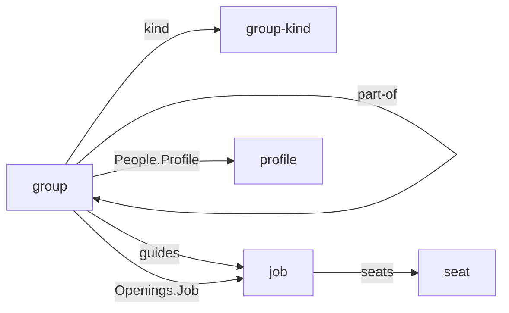

# Open positions, staff units and the order of groups

The organization pack lets a company say which units it has, who sits in each and in which place, and how the units hang together. An org chart drawn from it still misses three things every org chart in public practice shows: a position that is open, a unit or a person that serves a head from beside it rather than below it, and the order a company presents its units in. A unit can say who sits in it but not what it is hiring for, Legal hangs under the managing director like any department, and every chart comes out alphabetical. Issues #305, #306 and #307 recorded each gap; this spec closes all three inside the pack.

Status: decided by the owner on October 9, 2026: all three join the `organization` pack, departing from the rule that one company is a wait on the same ground the pack itself did, public practice; an open position is a row of a new `## Openings` table on the group, not a blank `## People` row and not a position type; an open `Lead` beside a held `Lead` is allowed and means a succession; a `Count` column says how many openings a row stands for; a staff unit stays in the line, flagged by an optional `staff` field on its kind, and a staff position is a new `Place` token, `Staff`; only a staff unit may hang below a staff unit, held by a check; groups are ordered by an optional `rank` across all groups, as R9 has it.

## Where this comes from

The run followed `companygraph-vocabulary`. Its sources:

- **A multi-person company the owner knows**, a software company, described and not named, the same one the pack came from. It shows each of the three ideas and keeps none of them in its model: an open position, a staff function beside the top of the company and a deliberate order of its units each appear around the model, never in a field of it.
- **Public practice for open positions**: the W3C Organization Ontology's `Post`, a position "that exists independently of the person or persons filling it" (<https://www.w3.org/TR/vocab-org/>); SAP's vacancy record, kept on a position whether or not someone still holds it (<https://help.sap.com/saphelp_em92/helpdata/en/4e/ebee1a11324e70e10000000a42189d/content.htm>); Workday's position management, which hires only into an open position (<https://doc.workday.com/admin-guide/en-us/human-capital-management/staffing/staffing-models/ivu1483299086459.html>); SuccessFactors' count of the people a position is meant to hold against those it holds; and the convention of drawing a vacant position as a box without a name (<https://en.wikipedia.org/wiki/Organizational_chart>).
- **Public practice for staff**: Gabler's Stab, a unit that contributes only indirectly by supporting one Instanz, either a generalist such as the director's assistant or a specialist such as legal affairs (<https://wirtschaftslexikon.gabler.de/definition/stab-45274>), and the Stab-Linienorganisation that attaches staff to the line's heads (<https://wirtschaftslexikon.gabler.de/definition/stab-linienorganisation-45349>); SAP's staff flag, set on a unit or a position that "reports directly to a high-level position or organizational unit" (<https://help.sap.com/saphelp_em92/helpdata/en/4e/ebef1a11394e6fe10000000a42189d/content.htm>); and the English line-and-staff organization, where staff advises and commands nothing outside itself.
- **Public practice for order**: org charts put the principal unit first and the others "in the order of their rank" (<https://en.wikipedia.org/wiki/Organizational_chart>); SAP orders the units within one level by a priority on the relationship to their parent (<https://help.sap.com/saphelp_470/helpdata/en/bb/bdba94575911d189240000e8323d3a/content.htm>); Oracle orders a node among its siblings (<https://docs.oracle.com/cloud/latest/enterprise-data-management-cloud/DMCAA/reorder_node_100x1d7f4feb.htm>); and chart tools sort by name unless the data carries a field to sort by.

The count. One company of one kind shows each of the three, thinly, keeping none of them in its model. The company of one has no units. The skill this run follows makes one company a wait for the second; this spec departs from it as the pack did, because public practice shows all three in every org chart it draws, and the pack exists so that a chart can be drawn from the model.

## Open positions

A group gains an optional `## Openings` table: what the group is looking for, one row per job and place.

| Column | Required | Type | Description |
| --- | --- | --- | --- |
| `Job` | Yes | ref → job | The job that is open |
| `Place` | Yes | enum | `Lead`, `Deputy`, `Member` or `Staff`, the place in the group that is open, as in `## People` |
| `Count` | No | number | How many openings the row stands for; blank is one |
| `Since` | No | date | From when the position is to be filled |

Each row draws an edge from the group to the job, so "which units are hiring a backend engineer" is a walk the graph answers. `## People` keeps its meaning, every row a person, and no check on it changes. A row leaves the table when the position is filled, and the person enters `## People` in the same change.

An open `Lead` beside a held `Lead` is allowed: it is the search for a successor while the present lead stays, as SAP keeps a vacancy on a position someone still holds. A chart draws the open place beside the person who holds it.

The schema's writing rules say that a job and place appear in one row, with `Count` for more than one, and that a `Count` is a whole number above zero. Both are norms of one page, which the agent pass holds.

## Staff units and staff positions

A staff unit stays in the disciplinary line. Its people have it as their unit, its lead answers to the lead of the group its `part-of` names, and every line check holds it as it holds any unit. What changes is how it is drawn and what may hang below it. `group-kind` gains one optional field:

| Field | Required | Type | Description |
| --- | --- | --- | --- |
| `staff` | No | enum | `yes` or `no`: a group of this kind serves the head of the group its `part-of` names, from beside it rather than below it; blank is `no` |

The writing rules say that `staff: yes` is written only on a kind that also carries `in-line: yes`, since staff outside the line serves no head in it.

A staff unit commands nothing outside itself, so what hangs below it is staff too. **A group whose `part-of` names a group of a staff kind is itself of a staff kind**, held by an instance check in the same pull request: the norm spans two pages, the group and the one it names, and through it the kinds of both. The check reads the `staff` field the way the line checks read `in-line`, and names no kind.

A staff position, the assistant to a head, is a new `Place` token, `Staff`, in the head's own unit. The existing checks hold it unchanged: a group in the line names a human in every row, `atMostOne` counts only `Lead`, and a person still has one place per group.

## The order of groups

`group` gains an optional field:

| Field | Required | Type | Description |
| --- | --- | --- | --- |
| `rank` | No | number | The group's place in the company's own order of its groups, spaced in tens |

R9 already makes `rank` the vocabulary's order within a type, unique across it, and the existing check holds `group` the day its schema declares the field. A walk down the tree gives a company its order: a parent before its children, siblings in the order the company presents them, and groups outside the line wherever it puts them. A renderer places a group without a rank after the ranked ones, by name. It is the first optional `rank` in the vocabulary, because a company that does not care how its units are ordered should not have to number them.

## The decisions, and why

1. **All three in the pack.** One company shows each, so the skill's rule says wait; public practice draws all three in every chart, as it drew units when the pack was decided.
2. **An opening is a row of its own table.** A blank `Profile` in `## People` would be one schema cell, but the parser drops the qualifiers of a row that names no entity, so the open job would reach no reader through the graph; it would need a rule that `Job` is required where `Profile` is blank, which no form says; and every reader would lose "every row is a person". A position type was rejected when the pack was decided and is again: each page needs a name nobody calls it, and the holder would be written on both the position and the group.
3. **An open lead beside a held lead is a succession.** Refusing it would need a check that reads two tables of one page, and would forbid what SAP allows on purpose.
4. **`Count`, not repeated rows.** Two identical rows cannot be told from a duplicated line, and the `As` rule binds only a table with an `As` column.
5. **Staff stays in the line.** Gabler and SAP attach staff to a head within the reporting structure. Placing a staff group outside the line with a `part-of`, the shape #306 proposed, would give `part-of` two meanings chosen by a field on another page and need a change to how `within` reads its two ends.
6. **Only staff below staff.** Gabler's staff commands nothing outside itself; a staff department with teams of its own keeps them as staff.
7. **`Staff` is a place, not only a kind.** Gabler's generalist staff and SAP's flag on a position are a person beside a head, which a unit of one would draw clumsily.
8. **`rank` across all groups.** A rank among the children of one parent is how SAP and Oracle store order, but it contradicts R9's "within its type", needs a scope for groups with no parent, and moves with every reorganization into a scope where it may collide.

## Where this departs from its sources

- **No position object.** SAP, Workday and the Organization Ontology make the position the thing that exists before and after its holders. Here an opening is a row that lives only while the position is open, and a filled position is a `## People` row. The pack's spec made the same call for held positions.
- **No vacancy state beyond open.** Workday's frozen and closed, and SAP's historical vacancy records, are left out: the history of an opening is in git.
- **The staff flag on the kind, not the unit.** SAP flags each unit or position. The pack already says what a group is through its kind, and a company's staff units are of a kind, so the flag goes there; a staff person is flagged by place.
- **Order across the type, not among siblings.** SAP keeps order on the edge to the parent, which a frontmatter field cannot carry, and Oracle among siblings. A walk down the tree gives the same chart.

## What was left out

A target date by which a position is to be filled, a reason it is open, and the supervisor an opening reports to, each of which an HR system keeps and none of which a chart needs. A staff function held by someone whose unit is elsewhere, such as an officer appointed beside a line job: that is a seat in core, held beside the job, and the pack needs nothing for it.

## Out of scope

Headcount targets, budgets and cost centers. Recruiting: a job posting, an applicant, a hiring process. A rendered org chart, which remains a consumer's work.

## What it costs

A minor release of the pack, with nothing breaking. In the pack's schemas: one optional table on `group` with four columns, one optional field on `group` and one on `group-kind`, and one token added to `Place`. One instance check, staff below staff, with its test, a new form that reads the kind of the group a field names as well as the kind of the group that writes it. The existing rank check, unchanged, reaches `group` through the field's name. The build also holds every table cell typed `number` to digits and every one typed `date` to R9's date form, as frontmatter values already are, which reaches every such column in core and every pack from this release on; `Since` and `Count` are the first. `example/` shows each: an opening in one of Beacon Systems' units, a staff unit and a staff place, and a rank on every group. The pack's README moves the three out of its list of what is left for later.

`People.Job` stays a qualifier on the row's edge to its profile. The diagram adds one edge to the pack's own, `Openings.Job`; `staff`, `Staff`, `Count`, `Since` and `rank` are values and draw none.
